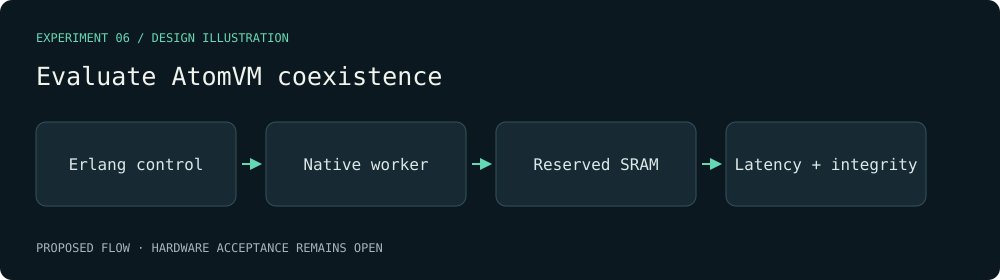

# Evaluate AtomVM coexistence — visual plan

Evidence class: **Design mockup**. This diagram is authored from the proposal, not a radio capture or a benchmark result.

Decision gate: A documented SRAM/linker budget and a bounded prototype that preserves CRC capture integrity and records VM latency over 100 capture/control cycles.

[Proposal](../../../openspec/changes/atomvm-can-coordinate-a-native-radio-worker/proposal.md).
