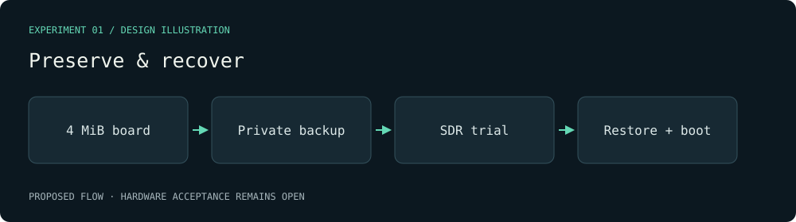

# Preserve & recover — visual plan

Evidence class: **Design mockup**. This diagram is authored from the proposal, not a radio capture or a benchmark result.

Decision gate: A 4,194,304-byte backup with SHA-256 plus a recorded restoration boot; a backup alone does not close recovery proof.

[Proposal](../../../openspec/changes/the-board-can-be-restored-after-an-sdr-trial/proposal.md).
