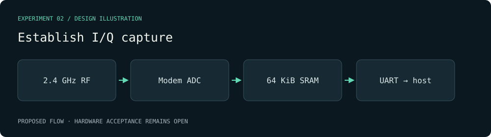

# Establish I/Q capture — visual plan

Evidence class: **Design mockup**. This diagram is authored from the proposal, not a radio capture or a benchmark result.

Decision gate: At least 100 CRC-checked snapshots per advertised rate with failures and timestamps counted; 60 seconds of browser display with gaps documented.

[Archived proposal](../../../openspec/changes/archive/2026-10-01-the-board-captures-repeatable-radio-snapshots/proposal.md).
