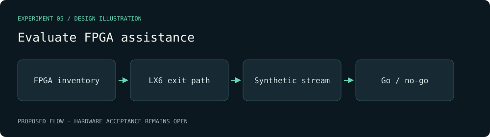

# Evaluate FPGA assistance — visual plan

Evidence class: **Design mockup**. This diagram is authored from the proposal, not a radio capture or a benchmark result.

Decision gate: An inventory plus sustained payload, loss/backlog and timing measurements. 80 MS/s × 20 bits requires 200 MB/s before framing; lower-rate or spectral output alternatives get separate budgets.

[Proposal](../../../openspec/changes/the-fpga-route-has-a-measured-feasibility-decision/proposal.md).
