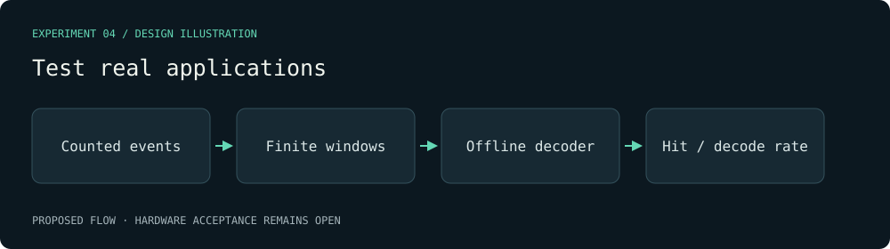

# Test real applications — visual plan

Evidence class: **Design mockup**. This diagram is authored from the proposal, not a radio capture or a benchmark result.

Decision gate: At least 100 deliberately emitted repeat events with ground-truth counts and capture hit rate; a decoding claim includes a complete waveform and verified payload.

[Proposal](../../../openspec/changes/the-receiver-can-observe-and-decode-short-bursts/proposal.md).
