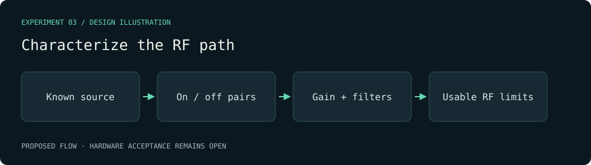

# Characterize the RF path — visual plan

Evidence class: **Design mockup**. This diagram is authored from the proposal, not a radio capture or a benchmark result.

Decision gate: Three repeatable source-on/source-off pairs with known center frequencies; each claimed extra tuning point has an independently known signal and uncertainty.

[Proposal](../../../openspec/changes/the-spectrum-reveals-controlled-24ghz-signals/proposal.md).
