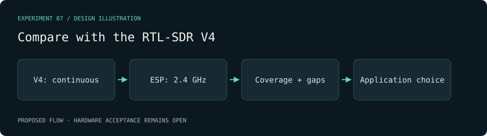

# Compare with the RTL-SDR V4 — visual plan

Evidence class: **Design mockup**. This diagram is authored from the proposal, not a radio capture or a benchmark result.

Decision gate: At least 60 seconds per V4 sample rate with lost-sample counts, plus measured ESP snapshot gaps. Each chosen application states the receiver, coverage, continuity and proof status.

[Proposal](../../../openspec/changes/archive/2026-10-01-the-two-receivers-have-a-measured-division-of-labor/proposal.md).
