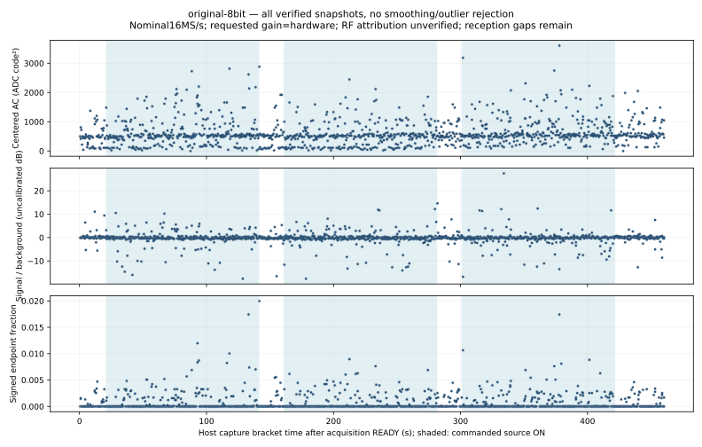

# Original eight-bit RF control: complete trial, no verified packet

October 4, 2026. The original **8-bit / BW12 / hardware-gain / LO2401 MHz**
profile completed three controlled source ON/OFF pairs. All **1,260** raw
snapshots pass independent length, SHA-256, CRC32, count and ordering checks.
An independent replay of the entire unchanged decoder agrees with the first
run: **zero complete CRC-valid owned or foreign packets**. This is a null
result, not proof of absent emissions or detection failure.

The [sanitized receipt](checks.json) records settings, schedule, restoration,
review hashes and phase summaries. Raw IQ, identities, flash backups and logs
remain private. The source is the existing owned BlueZ manufacturer-marker
test, not a counted-air source. The original Trial B prerequisite remains
unmet; no RF task or accepted requirement is checked off.

The separately reviewed caller fixes monitor readiness and parent deadlines,
freezes transitive helpers/runtime and binds the exact historical UART921600
artifact. Earlier failed caller probes remain intact. This prospective episode
uses a 540-second monitor and 460-second receiver with three 120-second ON
phases, 20-second intervening OFF phases and a 20-second initial baseline.
It changes no old trial or analysis band after observing an outcome.

Actual source intervals exceed 120 seconds each; both intervening OFF phases
exceed 20 seconds. Initial OFF is 21.147 seconds and the final transport payload
arrives 38.733 seconds after source process/bus closure. Normal monitor completion,
exact owned-container removal, producer reaping and source cleanup pass. These
are control-plane records, not independently measured RF transmission times.

Original firmware restoration passes a complete fresh **4,194,304-byte**
readback matching the preserved baseline, followed by the expected application
reset boot. The fresh pre-install read also matches. All owned UART/process
groups closed. No new electrical power-cycle measurement is claimed.

## Fixed-band scalar replay

This measured plot retains every verified snapshot, including nulls/outliers,
with whole request-to-payload brackets. Shading shows commanded source ON.
Before capture, the nominal channel37/LO2401 difference fixed the signal band
at **+0.5 to +1.5 MHz**, with equal-width background bands **−2.5 to −1.5 MHz**
and **+2.5 to +3.5 MHz**. Mean removal, symmetric Hann window, FFT/bin selection
and denominator regularizer were frozen. Old nonreciprocal +1.5 to +2.5 MHz
results remain retained and unchanged.

| Guarded phase | Captures | Median signal/background ratio |
| --- | ---: | ---: |
| Initial OFF | 54 | 1.043 |
| ON 1 | 322 | 0.996 |
| OFF 1 | 48 | 0.970 |
| ON 2 | 322 | 0.977 |
| OFF 2 | 49 | 0.995 |
| ON 3 | 323 | 1.001 |
| Final OFF | 103 | 1.040 |
| Transition/guard | 39 | 1.053 |

There is no repeated signal-band increase attributable to the owned source.
AC level drifts through ON and OFF, and descriptive distributions/time blocks
do not establish a calibrated gain or independent significance interval. These
results retain the failed positive control rather than selecting another band.

The windows total only **1.289925 nominal RF seconds** across **460.358 host
seconds**. Unknown radiated counts, channel activity, truncation, offsets and
gaps prevent a miss rate or sensitivity claim. Seven decoder candidates are
rejected by CRC, truncation or header checks; they are not received packets.

Next is the predeclared bridge-profile ladder: ten-bit/BW20/manual48,
eight-bit/BW20/manual48, eight-bit/BW20/hardware, then the original profile.
Each condition retains its own baseline, three paired controls and full
restoration. The earlier [fresh ten-bit/manual packet](../ble-matched-gain-001/README.md)
remains separate evidence; it cannot release original Trial B or establish a
gain ranking. Additional equipment is still needed for independently referenced
extended tuning and calibrated RF measurements.
