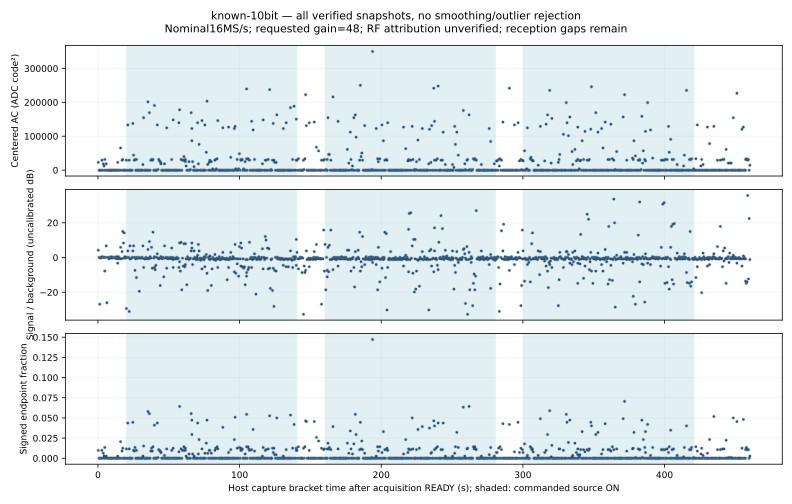

# Ten-bit control: reception from other sources, no owned packet

October 4, 2026. The separate **10-bit / BW20 / manual48 / LO2401 MHz**
condition completed three source ON/OFF pairs with **1,010** intact snapshots.
Independent replay verifies all **41,359,500** payload bytes and the whole
unchanged decoder result: **zero owned packets and three CRC-valid packets
from other sources**. Those payloads and device identities remain private.
They establish bounded BLE reception in this run, not reception of our source.

The [sanitized receipt](checks.json) binds the source, transport, full decoder
replay, restoration and review. The three redacted candidates at captures 712,
832 and 884 have complete nominal packet windows and whole guarded host
brackets in the third ON phase. This coincidence is not source attribution:
none matches the independently known manufacturer marker. Two packets are
352 µs and one is 208 µs; no foreign address, payload or payload hash is published.

All three source ON intervals exceed 120 seconds and both intervening OFF
intervals exceed 20 seconds. Initial OFF is 20.357 seconds; the last payload
arrives 39.276 seconds after source process/bus closure. Normal monitor
completion, owned-container removal, producer reaping, UART/process closure
and source disconnect pass. These are control-plane times, not measured RF
transmission times. The source supplies no independently counted air emissions.

Fresh pre-install preservation and full original **4,194,304-byte** post-trial
readback match the original SHA-256, followed by the expected application reset
boot. This is restoration proof, not a new electrical power-cycle measurement.

## Prospective fixed-band replay

The same previously reviewed method uses mean removal, symmetric Hann window
and nominal 16 MHz FFT, signal +0.5..+1.5 MHz and combined background
−2.5..−1.5/+2.5..+3.5 MHz. It retains every sample window, outlier and whole host
bracket; no band was moved after seeing peaks. Values are uncalibrated code
units. Peer review verifies the exact method/source binding, all row phases,
counts, ordered raw digest and published medians.

| Guarded phase | Captures | Median signal/background ratio |
| --- | ---: | ---: |
| OFF0 | 42 | 1.039 |
| ON0 | 259 | 0.898 |
| OFF1 | 39 | 0.915 |
| ON1 | 258 | 0.874 |
| OFF2 | 39 | 0.893 |
| ON2 | 259 | 0.898 |
| OFF3 | 84 | 0.910 |
| TRANSITION | 30 | 0.907 |

There is no repeated source-attributed nominal-band rise. The few redacted
packets do not turn the fixed-band controls into an owned-source positive.
The total nominal RF window is **1.0339875 seconds** across **460.129 host
seconds**. Unknown emissions, sparse windows, offsets, ambient interference
and truncation prevent a miss rate, sensitivity claim or confirmed detection
failure. Eleven additional candidates fail CRC, completeness or header checks.

The earlier [original eight-bit control](../ble-bluez-control-003/README.md)
and [fresh manual ten-bit owned packet](../ble-matched-gain-001/README.md)
remain distinct historical results. This trial changes no physical checkbox,
accepted requirement or original Trial B prerequisite. Next in the predeclared
ladder is eight-bit/BW20/manual48, then eight-bit/BW20/hardware. Fixed ordering,
restart and interference remain confounds; the ladder is not a calibrated
precision, gain or filter comparison.

## Executed helper provenance

This episode used the HCI host helper committed at `87fe60e`. A later fuller
metadata parser was merged only after terminal restoration; peer review checks
the old Git bytes against the retained input freeze. The dumpcap container
contains the capture executable; the sanitizer runs in host Python. Old
receipts are not upgraded by the new parser and do not prove its added fields.
