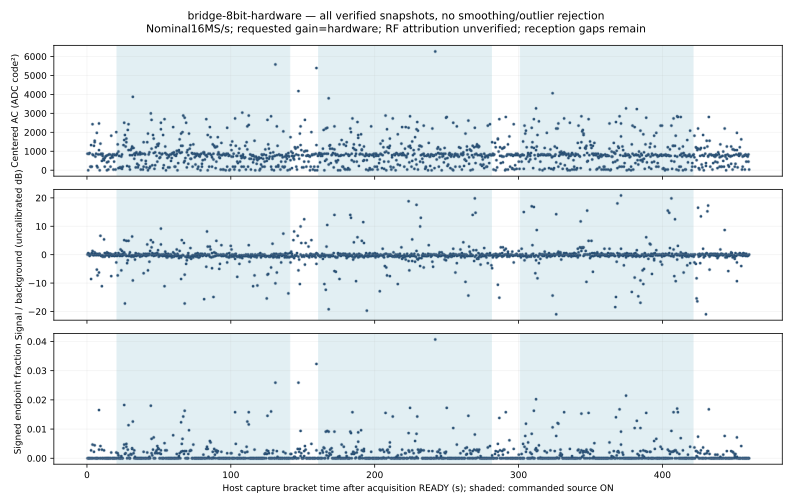

# Eight-bit hardware gain at BW20: complete null control

October 4, 2026. The separate **8-bit / BW20 / hardware-gain / LO2401 MHz**
condition completed all three controlled source pairs with **1,257 intact
snapshots**. Independent audit verifies **41,179,320 raw bytes**, the full
unchanged decoder replay, every fixed-method scalar measurement and phase.
The decoder finds **zero complete CRC-valid owned or other-source packets**.
This is a bounded null result, not proof of no emissions or detection failure.

The [sanitized receipt](checks.json) binds settings, review, timing and full
original restoration. Raw IQ, identities, backups and process logs stay private.
Nine candidates fail CRC or header checks. No independently counted air
emissions exist, so no detection or miss rate follows.

All three accepted source ON intervals reach 120 seconds and both intervening
OFF intervals exceed 20 seconds. Initial OFF reaches 20.864 seconds; the final
payload arrives 38.870 seconds after source process/bus closure. Normal monitor
completion, all owned resource closure and source cleanup pass. The expected
original reset boot follows a complete fresh **4,194,304-byte** readback matching
the original baseline. No new electrical power-cycle measurement is claimed.

DBus unregister acknowledgements precede some actual HCI disable/remove
completions by up to 7.759 ms. Independent audit explicitly checks enable and
cleanup completions against the predeclared one-second phase guards; all lie
inside those margins. DBus acceptance is not synchronous controller completion,
and neither timestamp measures radiated RF events.

## Every-window scalar replay

The previously frozen signal band remains +0.5..+1.5 MHz, with combined
background −2.5..−1.5/+2.5..+3.5 MHz, mean removal, symmetric Hann window and
nominal 16 MHz FFT. Independent replay unpacks every payload and checks the
exact method, per-window metrics, phase summaries and ten-second blocks. No
outliers, nulls or bands are selected after the outcome.

| Guarded phase | Captures | Median signal/background ratio |
| --- | ---: | ---: |
| OFF0 | 54 | 1.020 |
| ON0 | 322 | 0.962 |
| OFF1 | 48 | 0.970 |
| ON1 | 321 | 0.960 |
| OFF2 | 47 | 1.000 |
| ON2 | 322 | 1.010 |
| OFF3 | 104 | 1.013 |
| TRANSITION | 39 | 0.955 |

No repeated source-attributed signal-band increase is established. Windows total
**1.28685375 nominal RF seconds** across **460.311 host seconds**. Sparse windows,
unknown emissions, uncalibrated code units/clock/antennas and host timing prevent
sensitivity or causal gain/filter claims. The preceding
[manual eight-bit condition failed](../ble-bluez-control-005-failed/README.md);
it cannot be a qualified matched gain comparator. The
[ten-bit condition](../ble-bluez-control-004/README.md) remains separately reviewed.

Next is the predeclared original eight-bit/BW12/hardware bandwidth condition,
after reviewed future-prefix retention. Original Trial B still requires its
own current positive prerequisite; no physical task or accepted requirement
changes. The Taskfile/flake changed after this episode was terminal: independent
review binds their executed Git bytes and old immutable runtime rather than
pretending the new environment ran this trial.
