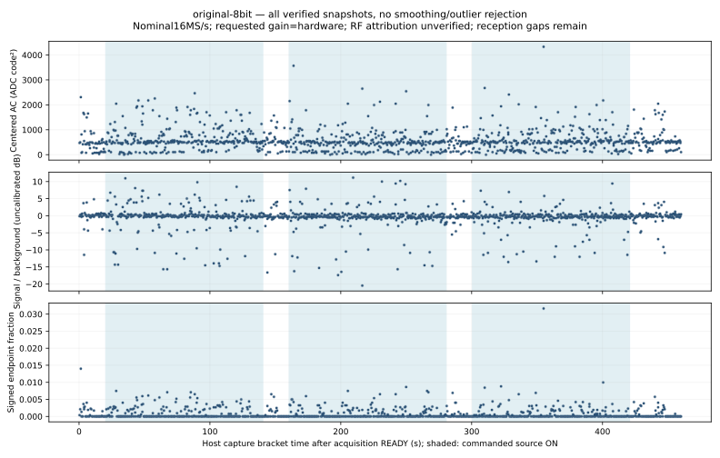

# Final original eight-bit BW12 control

October 4, 2026. Independent replay verifies all **1,151 intact snapshots**,
**37,706,760 payload bytes**, three controlled source ON/OFF pairs, normal monitor
completion, complete resource closure and original firmware restoration. Whole
legacy decoder replay finds **zero owned and zero other-source CRC-valid packets**.
[Checks](checks.json) bind executed inputs, independent review and measurements.

The preset is eight-bit, BW12, hardware gain, LO2401MHz, nominal16MS/s and
16,380 samples. The unchanged blind decoder uses channel37 and translation
−1MHz, replaying every private waveform rather than selected candidates.
The final bandwidth condition completes the prospective ladder; previous
nulls and the failed manual-gain episode remain retained.

The initial source-OFF interval is20.313579143s; the final payload arrives
39.138131413s after source-group closure. Receiver host duration is
460.011285906s. Combined nominal RF windows total1.17833625s; sparse windows
and unknown emitted-event counts prevent sensitivity, hit/miss rates or a
claim that the source did not transmit. Command/response brackets are host
timestamps, not hardware RF-start timestamps.

## Fixed nominal-band controls

Subtract the complex mean and apply a symmetric Hann window. Compare nominal
+0.5..+1.5MHz against equal-width −2.5..−1.5MHz and+2.5..+3.5MHz backgrounds.
Whole request/response brackets use the predeclared one-second phase guards.

| Phase | Intact captures | Median signal/background ratio |
| --- | ---: | ---: |
| OFF0 | 47 | 1.0607 |
| ON0 | 294 | 0.9993 |
| OFF1 | 44 | 0.9632 |
| ON1 | 296 | 0.9592 |
| OFF2 | 44 | 0.9541 |
| ON2 | 294 | 0.9652 |
| OFF3 | 96 | 1.0069 |
| TRANSITION | 36 | 0.9850 |

These controls show no repeated owned-source nominal-band rise. Quantiles and
ten-second block medians are descriptive, with no calibrated or IID confidence
claim. Profile order, resets and interference remain confounds.

## Preservation and boundaries

Both full pre/post images match the original4MiB SHA256
`6e8f0793916fa1d701415abc48c6ea91756cf864de8fdbf8459c181b08fc0974`.
Write verification, original application/SDK and GPIO high/low reset-boot tokens
pass. This is reset verification, not a fresh electrical power-cycle measurement.
UART/process groups, source bus and the exact monitor container close.

Reviewed failed-prefix retention was used; no terminal capture failure occurred.
All private capture/decoder artifacts stay0600 under0700 directories. Complete
source/monitor metadata passes independent replay; DBus acknowledgement timing
is not radiated timing. Repeat the reviewed private coordinator with a fresh
input/runtime/device freeze, then `task decode:ble` and `task report:ble` using
the explicit settings above. Hardware ownership and preservation remain required.

The original TrialB prerequisite remains unmet. Controller counts do not supply
an independently verified legacy-air denominator. The OpenSpec RF tasks remain
unchecked; earlier owned decoding remains a separate historical demonstration.
