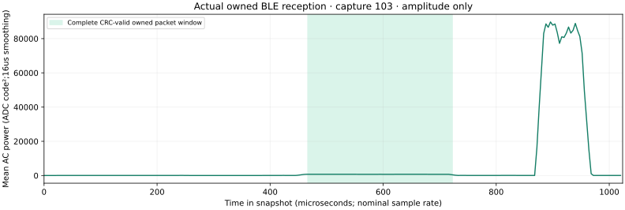

# One owned packet in the 10-bit controls trial

Recorded 2026-10-01. The same blind decoder used for the
[first physical proof](../ble-owned-decoding/README.md) replayed all **246**
10-bit captures. One distinct complete packet passes protected-PDU CRC24 and
exactly matches the independently chosen owned manufacturer AD. No foreign
CRC-valid payload was returned or published.

| Capture | Requested LO | Requested filter | Requested gain | Protected PDU | Full packet |
| --- | --- | --- | --- | --- | --- |
| 103 | 2401 MHz | 20 MHz | 48 | CRC24 pass, exact owned AD | 256 us nominal |

Capture hash: `d447221c076a09d79bcdb40e0309c2b5e39ca7a8f0c7593edb9faec4ede5a20b`.
Decoded owned PDU hash:
`177ba70ae0be7ffff890d04b3214f18a46cfe85e47b485bf82dd5c534c53aa45`.
Its packet type is 0 / ADV_IND, AA errors 0, preamble errors 1. Its nominal
preamble-through-CRC sample interval is **7464–11560**, entirely inside the
16,380-sample snapshot. The preamble is not CRC-protected; its observed hard
decision error is retained.

Eight successful receiver hypotheses for this access-start cluster count as
**one** physical packet. All 246 private capture hashes were checked against
the root capture CSV before replay. Digital translation is −1 MHz for requested
LO 2401 MHz and zero for requested LO 2402 MHz. The same fixed blind search
bounds and marker-after-CRC policy are used; no known-payload bit repair occurs.
The decoder replay took about 9.53 seconds on the recorded host.

The source-control timestamp join uses one-second guards and classifies 30
source-off captures with no AA candidates, and 216 source-on captures with five
AA-candidate captures and one verified owned packet. The known-marker result
is distinct from an AA candidate or visual spectrum feature.

This establishes a working 10-bit capture/decoder example at one requested
filter/gain setting. Twelve randomly timed windows per sweep cell, unknown
emission timing and varying clipping prevent a calibrated gain curve, filter
response or a claim that gain 48 is optimal. Actual hardware LO and analog
bandwidth remain uncalibrated. No decoded packet in other cells does not prove
those cells cannot receive. The **100 counted emitted events** gate stays open.

[Decoder manifest](decoder-manifest.json) records all input hashes, conditions,
blind search settings, sample bounds, timestamps, runtime and source phases.
[Actual amplitude envelope](owned-envelope.svg) exposes only smoothed power,
omitting phase, address and foreign bytes. Raw full IQ remains private for
independent replay; these public artifacts are not substituted for it.



```sh
python3 tools/ble_decode_controls.py --captures docs/evidence/rf-controls-trial/captures.csv --private .scratch/rf-controls-trial-raw --output .scratch/ble-controls-replay/decoder.json --bits 10 --rate 16000000
python3 tools/ble_trial_report.py --decoder .scratch/ble-controls-replay/decoder.json --captures docs/evidence/rf-controls-trial/captures.csv --source docs/evidence/ble-gain-source/source-results.json --private .scratch/rf-controls-trial-raw --output .scratch/ble-controls-replay/report
```
