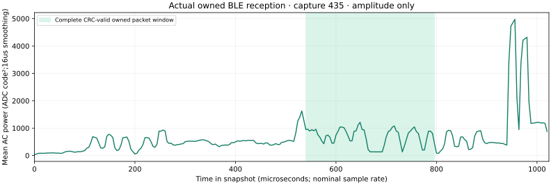

# Four complete owned BLE packets decoded from actual ESP32 IQ

Recorded 2026-10-01. **Four distinct captured packets pass 24-bit CRC and match
the independently chosen owned manufacturer AD exactly.** This demonstrates
bounded offline LE1M reception on this board. It does not establish continuous
packet capture, a missed-emission denominator or detection across all three
source episodes.

The input consists of 549 actual snapshots recorded by the root operator at
requested LO 2401 MHz, nominal 16 MS/s, 8-bit I/Q components and requested
12 MHz filter. All 549 transport CRC/sample-count checks passed independently.
Each snapshot has 16,380 complex samples. Original IQ remains privately stored
under ignored `.scratch/ble-reception-trial-raw/` because it can encode addresses;
the manifest retains hashes and filenames for local independent replay.

## Protocol and receiver proof

The source's independently chosen 12-byte marker is `ESP-SDR-EVAL`, manufacturer
test identifier `0xffff`, complete AD `0fffffff4553502d5344522d4556414c`.
[Source scheduling record](../ble-owned-trial/README.md) predates the decoder's
search. No marker bit was used to estimate timing, choose thresholds or repair
data. [Independent published Bluetooth SIG vectors](../../research/ble-evaluation.md)
verify chronological bit order, whitening and CRC.

Decoder revision: `a73148e`. It translates IQ digitally by −1 MHz, resamples to
4 MS/s and locates the public advertising AA. A bounded blind search tests
13 symbol periods (3.97–4.03 samples), 17 start positions (±2 samples), and
37 slicer biases (±0.45 of estimated deviation). Access-address correlation
must exceed 0.78 with at most two AA bit errors. Every candidate uses the
original waveform and requires the full protected PDU/CRC; no bit repair is
performed. The marker is checked only after CRC validation. AA correlation
selects among valid receiver hypotheses without preferring an owned payload.

All timing/slicing hypotheses around one access start count as **one** packet.
The complete 549-snapshot replay took about 5.37 seconds on the recorded host.
The initial single-threshold decoder produced zero CRC-valid packets; bounded
receiver refinement recovered these four.

| Capture | Protected PDU/CRC | Exact marker | PDU type | AA errors | Preamble errors | Nominal packet sample interval |
| --- | --- | --- | --- | ---: | ---: | --- |
| 435 | Pass | Pass | 0 / ADV_IND | 1 | 1 | 8645–12741 |
| 464 | Pass | Pass | 0 / ADV_IND | 0 | 0 | 1397–5493 |
| 499 | Pass | Pass | 0 / ADV_IND | 0 | 1 | 5543.16–9634.04 |
| 511 | Pass | Pass | 0 / ADV_IND | 1 | 0 | 1702.16–5793.04 |

Each PDU length is 22 bytes, with a nominal 256 us full packet duration. Every
preamble-through-CRC sample interval lies inside its 16,380-sample snapshot,
with substantial edge margin. Sample/time estimates use nominal rates and
receiver hypotheses; they do not calibrate the oscillator. Preamble and access
address are not CRC-protected; observed hard-decision errors are retained above.

The source requested BlueZ `Type=broadcast`, but the actually decoded protected
PDU type is **ADV_IND**, not ADV_NONCONN_IND. We retain the wire observation;
the API request and zero-frame HCI monitor cannot prove what type was configured.

The actual residual carrier estimate after translation is roughly +0.83 to
+0.85 MHz for these packets. This is a decoder estimate and reveals a tuning
uncertainty; it is not a calibrated RF frequency or evidence that the commanded
LO equals the hardware center. The selected I/Q modulation polarity is −1.

## Source phases and application limits

The source/capture timestamps share the host monotonic clock. Classification
requires the entire command-to-header interval to lie in one API control phase,
with a one-second transition guard. This labels source-control intent, not an
independent RF timestamp. The join verifies every IQ hash against the physical
capture CSV before assigning phases.

| Phase | Captures | Captures with AA candidates | CRC-valid owned packets |
| --- | ---: | ---: | ---: |
| Source-on episode 0 | 104 | 5 | 0 |
| Source-on episode 1 | 104 | 2 | 0 |
| Source-on episode 2 | 104 | 5 | 4 |
| Source-off phases combined | 201 | 1 | 0 |
| Excluded transition guards | 36 | 0 | 0 |

AA candidates alone do not prove owned reception. The one source-off candidate
has no valid CRC. The four verified packets all align with the third source-on
episode, so this run does not demonstrate payload decoding in three repeats.

| Application | Outcome from this run |
| --- | --- |
| Offline LE1M demodulation/DSP learning | Demonstrated for four complete owned packets |
| Reliable event counting / packet logger | Not demonstrated; emitted-event denominator unavailable |
| Continuous Bluetooth or hopping-session capture | Limited by short snapshots and UART gaps |
| Channel occupancy / interference observation | Partial; root paired-spectrum evidence is separate |

There are four packets, not 200 packets: 200 successful receiver hypotheses
across these four access-start clusters are duplicate solutions. Neither those
hypotheses, the 549 snapshot count nor three advertisement registrations provide
the required **100 counted emitted events**. That gate remains open.

## Public artifacts and replay

[Decoder manifest](decoder-manifest.json) includes exact input hashes, decoder
source hash, blind bounds, hypotheses, packet bounds, source phases and runtime.
[Amplitude envelope](owned-envelope.svg) plots actual capture 435, smoothed over
16 us. It exposes amplitude/timing only; phase, address and foreign payload bytes
are omitted. This is physical waveform evidence, not a design illustration.



After integrating these tools into the root repository, reproduce locally:

```sh
python3 tools/ble_decode_iq.py --input .scratch/ble-reception-trial-raw --output .scratch/ble-replay/decoder.json --rate 16000000 --bits 8 --channel 37 --frequency-translation-hz -1000000 --refine
python3 tools/ble_trial_report.py --decoder .scratch/ble-replay/decoder.json --captures docs/evidence/ble-reception-trial/captures.csv --source docs/evidence/ble-owned-trial/source-results.json --private .scratch/ble-reception-trial-raw --output .scratch/ble-replay/report
python3 -m unittest discover -s tests -p 'test_ble*.py' -v
```

The capture files are required for physical replay and are intentionally absent
from Git/site export. Public hashes and summaries do not replace that replay.
