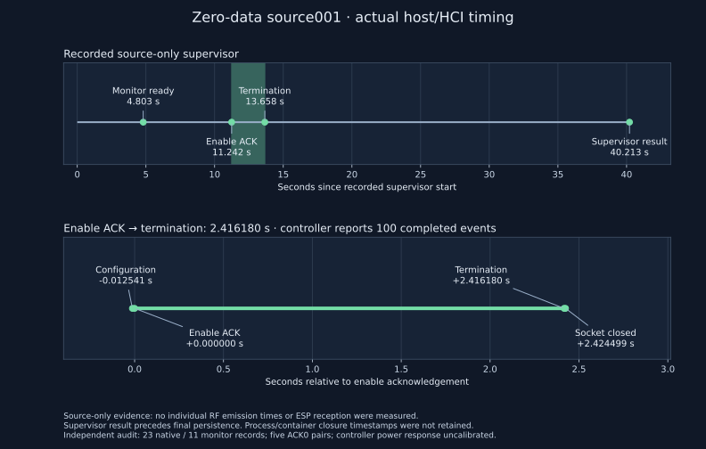

# Zero-data source001 saved-result review

October 4, 2026: **PASS for this source-only controller profile**, executed at
`7159eb7`. Independent saved-file audit verified 23 native and 11 monitor
records: five ordered command/ACK pairs, every requested v1 parameter/data
field, ACK0 throughout, and one handle1 termination `0x43/count100`. Host AD
was empty. Both readers returned selected power 7 dBm, an uncalibrated controller
response. Disable/remove ACK0 and native socket/container closure were retained.

[Checks and hashes](checks.json) bind the immutable private review, all six trial
files and corrected root preparation. Eighteen frozen inputs, nine runtime files
and fourteen executed Git blobs match; all 43 retained peer-proof file hashes
match. Preparation 107 author plus 5 general / 3 actual-Git peer groups supplements
the historical 104 + 5 review without replacing earlier failures. The 300-path
store verification was retained preparation proof, not repeated by this audit.
The private audit ran through locked Nix/Task without device, DBus or Docker calls.

The recorded supervisor lasted 40.21294 s; outer/header readiness took 4.80346 / 
1.74455 s. Both groups were recorded naturally closed, producer/parent reaped,
controller pre/post state matched and selected-image containers were reported
absent. These are checked-source/operator attestations: child PGIDs/container
IDs and exact spawn/closure brackets were not saved for retrospective OS checks.
Shared FD/lock continuity follows inspected operator/caller code, not a saved
kernel lock history. The supervisor timestamp precedes final persistence; setup/final whole
wall brackets are absent. Raw monitor pcap, producer logs and identity stay private.

**100 means controller-completed extended advertising events**, not independently
counted radiated primary frames. This supplies no RF reception, AdvA/AUX ownership,
legacy 255 denominator or TrialB release. Original physical RF tasks remain open.
The [declared protocol](../../research/ble-primary-zero-data-readiness-protocol.md)
and prior preparation failures are unchanged.

## Measured host/HCI timing

The hash-bound private lifecycle yields a 2.416180382 s enable-ACK to
termination span and a 40.212939816 s recorded supervisor. The plot contains
relative host/HCI times only, with no individual RF emission ticks or inferred
process/container closure brackets. It does not describe final persistence time.

Reproduce with the locked Nix shell and `task plot:primary-source-timing`, passing
the retained private lifecycle, this directory's `checks.json`, and an output path.
Published SVG SHA256: `3b2f01b68b0230dc7b64262f77574a0b731a2cb1e027dfa5569b5f1cf8c8e146`.
