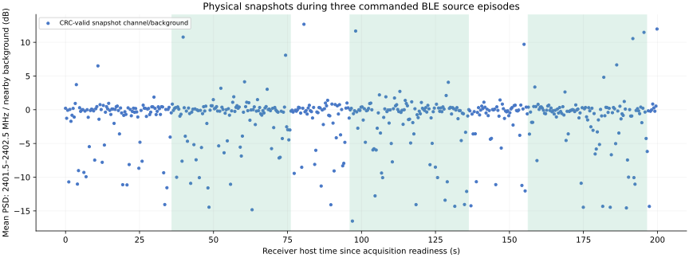

# Three-cycle owned-source RF capture

Physical acquisition, 2026-10-01: **549 / 549 snapshots passed payload CRC and
sample-count checks** during a 200-second bounded series. This record does not
by itself establish packet decoding, emitted-event counts or calibrated RF.

The original ESP32 ran clean `550fade-uart921600`, at requested LO 2401 MHz,
filter 12 MHz, hardware AGC, 16 MS/s nominal, 8-bit I/Q and 16,380 pairs.
The owned host Bluetooth source requested channel-37 advertisements at nominal
2402 MHz, so the requested LO offset is +1 MHz. The host/card antennas and their
physical separation are not measured. No attenuator, calibrated RF generator
or power/frequency reference is available to this software-only trial.

[Manifest](manifest.json) retains exact protocol/settings replies and readiness
time; [per-capture CSV](captures.csv) contains actual host monotonic timestamps,
integrity, private payload hashes and anonymous code statistics. All original
IQ stays ignored and private under `.scratch/ble-reception-trial-raw/`.
The source operator separately registered three 40-second episodes with
20-second OFF gaps: [source control and cleanup](../ble-owned-trial/README.md).
Accepted registration timestamps are not precise RF emission times.

[Pair summary](pair-summary.json) aligns the same-machine monotonic clocks,
excluding two seconds at each transition. There are 88/98, 45/99 and 44/99
OFF/registered snapshots in the three pairs. Their channel/background 95th
percentiles are 0.87/1.56, 0.96/1.76 and 0.82/1.37 dB, respectively. Median
levels hardly change; one OFF interval has a stronger maximum than its ON
interval. These aggregate differences cannot identify individual packets or
establish calibrated signal strength. The shaded intervals show source
registration, not independently observed RF ON/OFF.

The PSD statistic compares average windowed-FFT power from requested
2401.5–2402.5 MHz with two nearby 1 MHz bands centered at 2399 and 2404 MHz.
It depends on the nominal sample rate and requested LO; RF frequency accuracy
has not been independently calibrated. Plot reproduction:
`python3 tools/plot_owned_ble_pairs.py docs/evidence/ble-reception-trial docs/evidence/ble-owned-trial/source-results.json`.

[Known-marker decoding](../ble-owned-decoding/README.md) and independent review
verify four distinct protected PDUs and complete captured packet windows, all
in the third source-ON phase. The exact independently chosen AD and packet CRC
match. This proves those packets; it does not establish reception in all three
repeats or supply the missing independently counted 100-emission denominator.
The controlled RF and event-observation proposals remain open pending their
specific gates. All receiver handles closed after acquisition.
