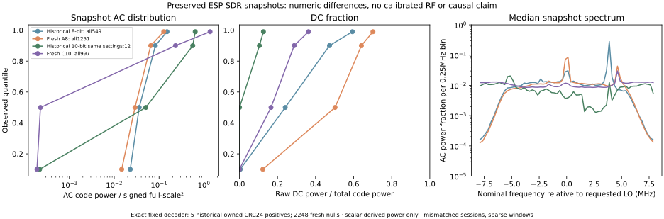

# Preserved waveforms differ; fixed decoding remains five historical positives and 2,248 fresh nulls

This offline audit replayed the **unchanged fixed decoder**, not a corrected
method. All 549 historical 8-bit captures, the 12 historical 10-bit captures
with the same requested settings as fresh C, and every fresh A/C capture passed
independent SHA256, CRC32, byte/count and packing checks. The decoder reproduced
four historical 8-bit and one historical 10-bit owned CRC24-positive snapshots;
all **1,251 fresh A and 997 fresh C** snapshots remain null. No waveform, decoder,
acceptance gate or previous result was changed, and no hardware/Docker operation
was performed.

The [numeric comparison](comparison.json) retains every group's quantiles,
all five nominal packet-window measurements, scalar coarse spectra, ordered
input-digest proof and exact decoder parameters. Eight public input files match
root revision `9d1b553db8327c0bab6da0e2f745d08495ba7f85`. Historical positive
selection is conditional on decoding; the complete historical 549-capture set
and the same-settings 12-capture cell remain visible to reduce selection bias.

| Set | Snapshots | Median AC power (code²) | Median raw DC share | Median processed −1 MHz coherent share |
| --- | ---: | ---: | ---: | ---: |
| Historical 8-bit, all | 549 | 591.34 | 24.07% | 58.23% |
| Historical 8-bit, positive snapshots | 4 | 619.96 | 14.75% | 24.04% |
| Fresh A, 8-bit, all | 1,251 | 475.89 | 50.23% | 71.03% |
| Historical 10-bit, same requested C settings | 12 | 13,257.19 | 0.063% | 2.72% |
| Historical 10-bit, positive snapshot | 1 | 6,977.23 | 0.155% | 5.16% |
| Fresh C, 10-bit, all | 997 | 59.38 | 16.59% | 60.64% |

These are separate medians, not ratios of medians or measured gain/SNR.
Fresh C's ON/OFF median AC powers are 59.7510/58.7185 code². Its median unique
I/Q code counts are 31/47, versus 460.5/619 in the historical same-settings cell.
The historical/fresh median AC-power ratio is about 223; this describes ADC
codes across different sessions, not a calibrated 23.5 dB RF difference.
Endpoint fractions and high-power outliers remain in the full quantiles.
Acknowledged manual setting 48 is not independently measured effective RF gain.



The plot shows observed quantile points and medians of individual scalar spectral
bins. Spectra contain only centered AC power, with 0.25 MHz bins; they carry no
complex samples, packet bits or addresses. Spectral power is not assigned to
owned or foreign transmitters. The actual SVG was rendered and inspected.

## A concrete preprocessing effect, with an unproven causal link

The fixed [decoder at the reviewed revision](https://github.com/knewter/esp-sdr-stuff/blob/9d1b553db8327c0bab6da0e2f745d08495ba7f85/tools/ble_decode_iq.py#L159)
first multiplies IQ by the −1 MHz oscillator, then removes the resulting mean,
then applies `resample_poly` down to 4 MS/s. A constant component of the original
snapshot therefore becomes a −1 MHz tone. Subtracting the translated mean
removes a zero-frequency component and leaves that shifted tone in the passband.

The audit executes exactly that order and measures a coherent −1 MHz projection
on the processed samples, trimming 64 samples at each filter boundary. Its
squared amplitude divided by processed mean power is the table's coherent share.
It is a finite-window scalar projection, not a calibrated RF carrier or noise
measurement. The five historical packet windows contain only **1.57–3.24%**
coherent share, compared with fresh whole-snapshot medians of 71.03%/60.64%.
This identifies a measurable conditioning effect worth a separately declared
paired control. It does **not prove** that residual DC caused the nulls: the
historical all-8-bit median is already 58.23%, and some fresh snapshots have
little coherent tone. Physical placement, interference, source cadence and
receiver state were not controlled across these sessions.

The [synthetic method check](method-checks.json) verifies the projection without
an owned packet: DC `5+3j` plus amplitude-two tone at nominal +1.8 MHz gives
expected DC share `34/38=0.894737`, measured processed coherent share 0.894984.
A zero-DC input through the same unchanged preprocessing gives 1.34×10⁻⁸.
These are method checks, explicitly separate from real RF acceptance. No
DC-first or other alternative method was replayed in this audit.

## Carrier-band and snapshot limits

All five decoded packet windows put **85.65–88.44%** of centered AC spectral
power in nominal +1.5..+2.5 MHz relative to the requested LO, and only **5.01–8.06%**
in +0.5..+1.5 MHz. Their existing fixed-decoder carrier estimates are
+0.825..+0.870 MHz *after* the −1 MHz digital translation. These are nominal,
uncalibrated frequency axes, not a hardware LO readback. The fresh capture
helper's `channel_to_background_db` uses the +0.5..+1.5 MHz signal band. Its
chosen-band ratio therefore cannot be treated as owned-packet SNR or an
independent source-presence detector; the historical accepted packets occupy
substantial power outside that chosen band.

Each snapshot is 16,380 samples, nominally **1.02375 ms**. Fresh A samples
1.280711 seconds over 460.085 host seconds (**0.2784%**); fresh C samples
1.020679 seconds over 460.200 host seconds (**0.2218%**). These fractions describe
sparse nominal capture windows and serial gaps. They are not probabilities of
catching advertisements or counts of missed emissions. Unknown waveform
activity between snapshots stays unknown.

## Packing, reproduction and scope

An independent 10-bit reader reconstructs four signed components from each
five-byte group using 40-bit little-endian shifts; it exactly agrees with the
existing bit-array reader on all selected payloads. The signed edge vector
`−512,−1,0,511` also passes. The pinned [firmware packing source](https://github.com/ESPARGOS/esp-sdr/blob/550fadea4d00a9e26ce921c5832167becb3dc20c/main/targets/esp32/receiver.c#L135)
shows that 8-bit components retain the upper eight of ten bits. The plot therefore
normalizes AC code power by the square of each format's signed full-scale
magnitude (128 or 512); comparisons within the same format also retain code².
This does not calibrate the analogue chain or conversion gain.

[Execution metadata](execution.json) pins the locked Nix environment, source,
Task recipe and method check. The actual full comparison took 31.07 seconds.
The [analysis source](analyse.py) and [Task recipe](Taskfile.yml) perform only
saved-data operations. To repeat after this folder is in the main checkout,
choose fresh ignored output paths:

```sh
nix develop .#ci --command task --taskfile docs/evidence/ble-waveform-comparison/Taskfile.yml compare -- --root "$PWD" --output "$PWD/.scratch/waveform-comparison-next" --private-output "$PWD/.scratch/waveform-comparison-next-private"
```

Private raw inputs must already exist in the paths recorded by the earlier
[historical 8-bit](../ble-owned-decoding/README.md),
[historical 10-bit](../ble-controls-decoding/README.md),
[fresh A](../ble-bluez-control-001/README.md) and
[fresh C](../ble-bluez-control-002/README.md) evidence. Raw IQ and per-capture
numerical scratch output remain ignored; no raw bytes or unique identifiers
are exported here. The native reference/comparison is separate Bluetooth
reception. None of this audit supplies an RF emission denominator, fresh SDR
positive, repeatability proof, sensitivity/range result, Trial B prerequisite
or RF/count acceptance.
