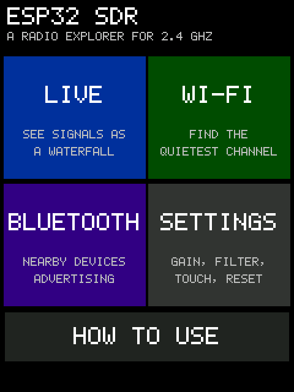
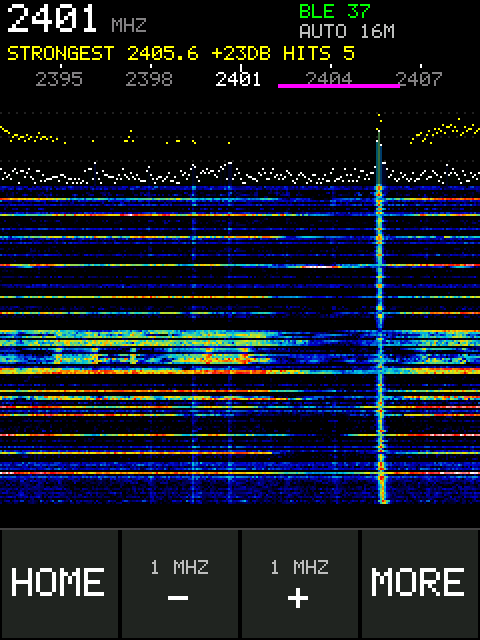
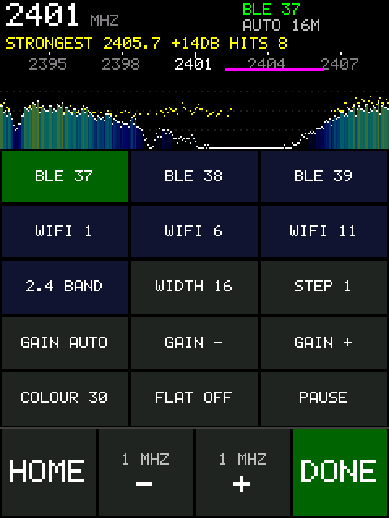
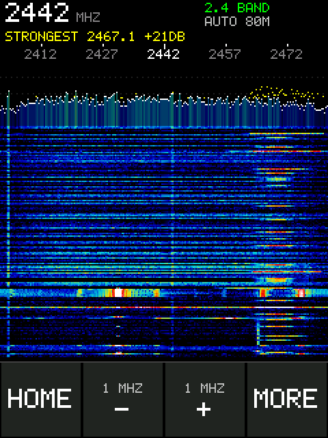
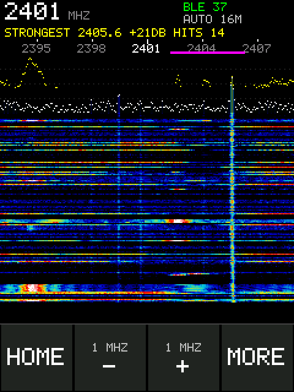
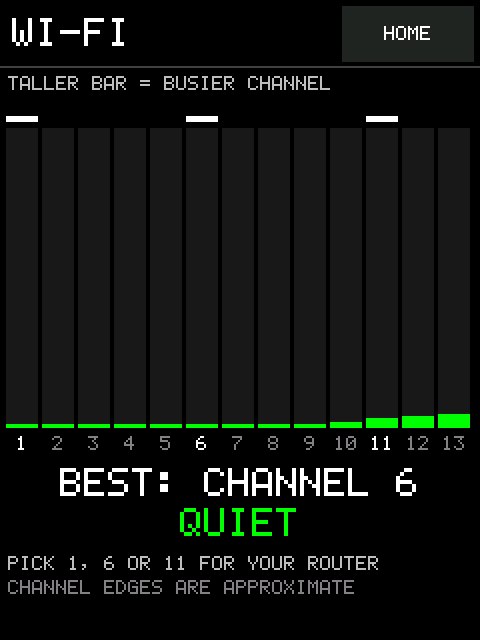
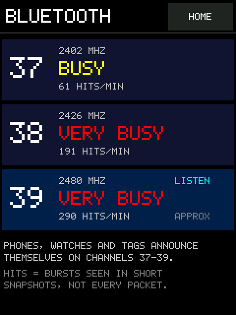
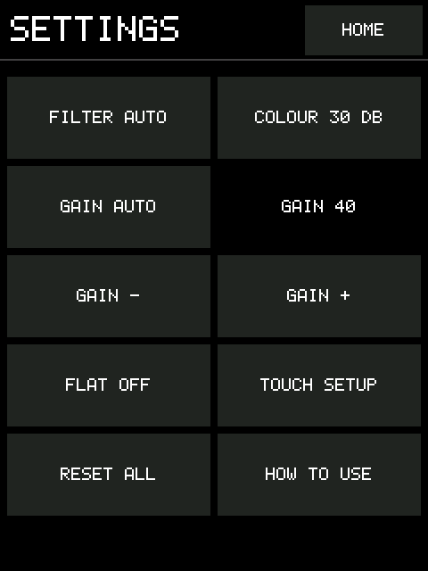
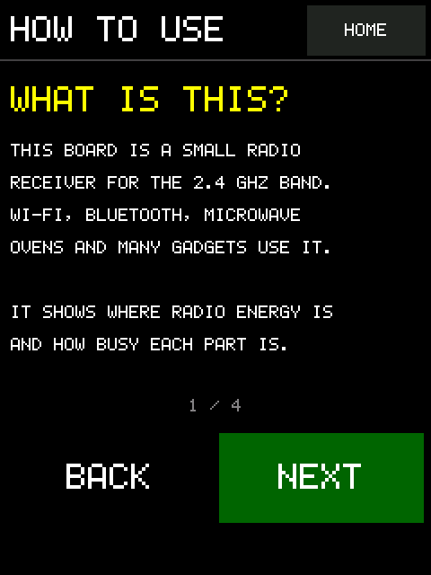

# CYD on-screen waterfall

Plan: [OpenSpec change](../../../openspec/changes/the-cyd-shows-a-tunable-live-waterfall/proposal.md).
Source: [firmware/cyd-waterfall](../../../firmware/cyd-waterfall/README.md).

## Build (2026-10-06, host only)

`tools/build_cyd_waterfall.py` built ESP-SDR `550fade` (esp-dsp `a53a075`)
with the overlay in the locked `.#firmware` shell. The configuration is
UART 921600 and the version is `550fade-cyd-waterfall`.
- **Build:** clean, with no compiler warnings from the display sources. The
  app partition has 33% free.
- **Image hashes:** in [build-info.json](build-info.json). Flash with dio,
  40 MHz, 2 MB at 0x1000, 0x8000 and 0x10000.
- **Changes to the receiver:** limited to one include, the wrapper
  functions over the existing static radio routines, an init call and the two
  idle/host-activity calls ([receiver-hooks.diff](receiver-hooks.diff)). CMake
  adds the two sources and the `esp_lcd`, SPI and GPIO driver components for
  the ESP32 target only.
- **Host tests:** `tests/test_cyd_waterfall_logic.py` compiles the logic file
  and runs 9 tests, all passing.

## Install and host check (2026-10-06)

The build was written to the CYD at 460800 baud, and every region was
hash-verified. The CYD's original image stays preserved in `backups/cyd/`.
- **Boot:** the display code printed `#CYD panel ILI9341 id 18 02 06 00`.
  Those ID bytes match neither the usual ILI9341 reply nor the ST7789's
  `85 85 52`, so the panel type is still unconfirmed.
- **Host protocol:** the capture tool's queries returned the same `INFO`
  (`ESP32SDR 6 burst 16380`) and `LIMITS?` as the receiver image. A 20-window,
  16 MS/s capture at LO 2401 MHz completed 19 windows; one was lost to a UART
  fault and recovered, as in the session 004 and 005 captures under host load
  ([host-capture-results.json](host-capture-results.json)).

**Screen and touch are not yet shown.** They need a photo or video from the
board (tasks 2.1–2.3).

## Beginner screens, device screenshots and measurements (2026-10-06/07)

The build now opens on a **home screen** with four entries:
- **LIVE:** spectrum and waterfall, with `HOME`, `−`, `+` and `MORE`.
- **WI-FI:** how busy channels 1–13 are, plus the quietest of 1, 6 and 11.
- **BLUETOOTH:** activity on advertising channels 37–39.
- **SETTINGS.**

A four-page **HOW TO USE** guide sits below them.

**Screenshots** are read back from the panel's own memory by the new `CYDSHOT`
command. `CYDTAP` drives the screens remotely, and `CYDSTAT` reports the
measurements. These commands do not pause the display. `tools/cyd_device.py tour`
produced the images below.

| | |
| --- | --- |
|  |  |
|  |  |
|  |  |
|  |  |
|  | |

**Measurements** ([measurements.json](device/measurements.json)):

| Screen | Rows/s | Capture | Process | Draw |
| --- | ---: | ---: | ---: | ---: |
| LIVE | 23.0 | 1.4 ms | 5.5 ms | 22 ms |
| WI-FI (80 MHz view) | 42.8 | 1.2 ms | 5.5 ms | 3.7 ms |
| BLUETOOTH | 41.4 | 1.4 ms | 5.5 ms | 4.4 ms |

- Retuning takes 0.61 ms.
- A screenshot takes 2.7 s.
- About 221 KB of heap stays free.
- Before batching 12 spectrum rows per SPI transfer, LIVE ran at 14.5 rows/s
  with 49 ms of drawing.

**What the device showed that the simulator could not:**
- **Filter width.** The automatic RF filter passes only about 22 MHz, so the
  80 MHz view showed a saturated block. The filter now follows the view width:
  automatic at 16 MHz, 40 MHz at 40 MHz, 67 MHz at 80 MHz.
- **Wi-Fi floor.** A floor that tracked the noise minimum made every Wi-Fi
  channel read 30–45 % busy. A per-column median floor with a 10 dB threshold
  gives 3–12 % in this room.
- **The panel setup.** A second SPI handle on the same chip-select pin left
  the panel blank. Chip select is now held low and pulsed before reads.

**Bluetooth calibration** ([ble-calibration.json](ble-calibration.json)):
- **Offline, on session 005** (same board, LO 2401 MHz, decoded owned packets
  as ground truth), the detector finds **6 of 6** true packets.
- **Tuning drift.** The board's tuning error moved by about 1.1 MHz between
  retunes, seen as a steady carrier at column 199 in session 005 and near 182
  on the device. A fixed ±2-column window would then find **0 of 6**. The
  detector therefore searches ±2 MHz against each column's median, finding
  6 of 6 at a 4.7 % source-off rate.
- **On the device**, with the counted source on ch37 for 20 cycles, the ch37
  rate did **not** rise measurably: 70.2/min off against 70.8/min on. One
  advertiser should add about 7/min, which is within counting noise against
  ambient narrowband activity of about 5 % of rows.

The Bluetooth screen therefore reports **overall activity** per advertising
channel, in plain words. It does not count one device. Task 2.3 stays open.

**Simulator.** `tools/cyd_sim.py` and `tests/test_cyd_display_sim.py` (15
tests) run the same sources against emulated hardware. Simulator images are
illustrations, not hardware evidence.
