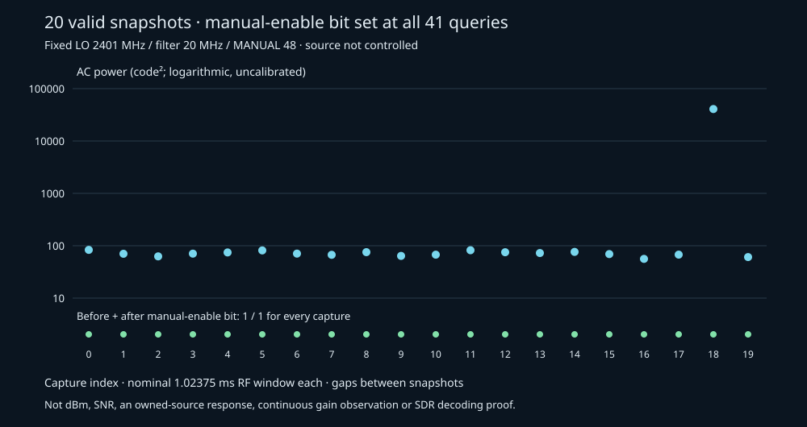

# The queried manual-enable bit stays set during 20 snapshots

[Independent review](../gain-state-independent-review/README.md) passes actual
private wire/IQ replay, all gain replies, executed provenance, public plot and
complete original restoration. The review accepts this diagnostic's scope;
SDR reception and transmitted counts remain unproven.

Recorded 2026-10-02 after the [completed native BLE reference](../native-ble-source-reference-002/README.md)
and its independent review. The [prospective protocol](../../research/esp-gain-state-diagnostic.md)
applied receiver settings once, acquired exactly **20 integrity-valid snapshots**,
and observed bit23 set at **all 41 gain queries**. Acquisition took **10.299817
seconds**, within the absolute 30-second ceiling. The full original flash and
reset boot were then restored.

## Fixed settings and measured scope

The exact Nix-built `550fade-uart921600` receiver used LO 2401 MHz, requested
filter 20 MHz, MANUAL gain index 48, nominal 16 MS/s and ten-bit components.
`FREQ`, `BANDWIDTH` and `GAIN MANUAL 48` were applied once. There was one gain
query after settings and one before and after each capture. No settings were
reapplied, and no retry or resynchronization occurred in the capture loop.

[Results](probe/results.json) retain every complete command/reply bracket,
count, CRC32, private payload hash and numerical statistic. Every capture
contains 16,380 pairs and 40,950 bytes: **819,000 payload bytes** total. Each
nominal RF window is 1.02375 ms, separated by UART delivery gaps. The twenty
windows sum to **20.475 ms**; they are not continuous reception. The saved
829,527 consumed UART bytes were reread with SHA-256
`6b985a7e7451d044912ac116fdcb729b88a33796464f1aeb6a779dc2a094ea27`.
The consumed-byte record covers bytes committed to the host buffer, not an
unobserved final kernel-read boundary. Raw wire and IQ remain private.

[CSV](gain-captures.csv) and [summary](summary.json) preserve all captures.
Plot power is uncalibrated AC code²; the source was not controlled. Variation
does not identify a transmitter, signal-to-noise ratio or known-source response.
No packet decoding or emitted-event denominator is claimed.

`GAIN?` reports software mode/index and a startup maximum; only its final bit23
field reads live hardware state. All queried bits being one weakens a persistent
manual-enable mismatch explanation for **this run**. It neither observes the
bit continuously nor reads the effective gain index, calibrated gain or state
in earlier controls. The fresh [8-bit](../ble-bluez-control-001/README.md) and
[10-bit](../ble-bluez-control-002/README.md) SDR nulls remain unresolved.
Native success and this diagnostic do not satisfy Trial B's SDR-positive
prerequisite or close RF, protected-PDU or count acceptance gates.

## Preservation, ownership and restoration

[Orchestration](orchestration.json) records the six committed native prerequisite
hashes, actual receiver manifest/parts and frozen executed helper hashes. The
exclusive operator held the common lock through installation and restoration.
The UART worker closed before private persistence and all owned UART groups
closed before restoration. No Bluetooth source operation occurred.

[Before-install read](before-install.json) and [restoration](restoration.json)
each match all **4,194,304 bytes** to preserved original SHA-256
`6e8f0793916fa1d701415abc48c6ea91756cf864de8fdbf8459c181b08fc0974`.
The original application, SDK and both GPIO messages appear on reset boot.
Electrical power removal was not measured. Backup images, boot logs and device
identifiers remain private. The probe's `restoration_performed=false` denotes
its worker boundary; the enclosing lifecycle performed and verified restoration.

Run envelope: `nix develop --command task -t .scratch/run_gain_state.task.yml run`
with the exact reviewed receiver artifact, committed native002 prerequisite and
fresh ignored private/output directories. The preserved private Task wrapper
owns the full lifecycle; the standalone probe is not a preservation command.
Report: `nix develop .#ci --command task -t .scratch/report_gain_state.task.yml report`.
The summary hashes the executed report script. A further RF or settings
comparison requires its own declared conditions; no fallback trial follows
automatically from this result.
