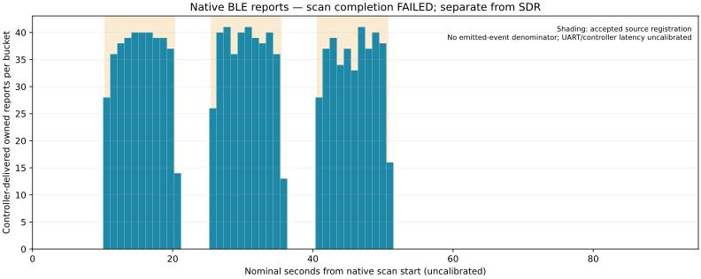

# Native BLE reports arrived, but scan completion failed

Recorded 2026-10-02. The separately installed native observer delivered **1,160
matching owned-marker reports** during the three source episodes. Its requested
90-second API scan never delivered discovery completion. The watchdog emitted
`SCAN_TIMEOUT/-1`, no END exists, and both the capture and supervisor are
**failed**. This is a retained failed diagnostic with useful reception evidence,
not a completed native reference or SDR proof.

The app uses the supported Bluetooth stack on this same ESP32 and hops primary
advertising channels. Counts are controller-delivered matching reports. They
are not emitted events, a detection rate, protected-PDU/CRC replay, simultaneous
evidence for earlier SDR trials or an independent RF instrument. UART JSON has
no transport CRC. Typed schema, fresh nonce, consecutive intervals/cumulative
counts and saved byte hashes are separate integrity checks.

[Capture](capture.json) retains 92 contiguous aggregate buckets and the failed
status. [Summary](summary.json) and [bucket CSV](native-buckets.csv) map whole
firmware intervals from the complete READY receipt bracket with one-second
transition guards. Guarded nominal ON episodes contain 275, 275 and 261 reports;
the four nominal OFF segments contain zero. The remaining 349 reports are in
22 excluded transition buckets. Clock rate, controller/API and UART latency are
uncalibrated; these phase labels and the chart do not give exact RF event times
or calibrated bounds. The last valid aggregate is at nominal 92.902916 seconds;
there is no successful scan duration.

The private UART log contains **23,986 bytes**, SHA-256
`b0e24b6c15511ca238335f501158823cb4f0a003f92b84a9cfbdc0d34cc41a15`.
Received/saved lengths and reread hash agree. Raw UART, backups, build logs and
device identifiers remain private. Boot reaches CONFIG/READY only after the
target NIST AES and in-place self-tests pass; this does not turn scan failure
into successful completion.

[Source receipt](source.json) records three completed ten-second registrations,
five-second OFF gaps, removal and bus disconnect. [Monitor](monitor.json)
contains 15 successful matching HCI command completions: properties `0x0013`,
channel map `0x07`, 20-ms requested interval, LE1M, exact whole manufacturer AD,
Duration=0 and MaxEvents=0. All source counts remain null. No global adapter
reset, event-mask change, power change, connection or pairing was used.

## Why the finite scan failed

The pinned SDK's [host timer dispatch](https://github.com/espressif/esp-nimble/blob/1a714b03dcea55e58066e21213a5f150f2e50088/nimble/host/src/ble_hs.c#L577)
calls `ble_gap_timer()` only when `NIMBLE_BLE_CONNECT` is enabled. Both connection
roles are disabled in this observer-only build. The finite discovery request
schedules a deadline, but that role configuration omits its timer dispatch.
This explains the missing completion callback without establishing a radio
failure. Version 1 remains failed. A future, separately versioned app must stop
at 90 seconds through the public cancel API and verify successful stop/inactive
state; it must identify application cancellation explicitly rather than claim
a natural completion callback.

## Recovery and scope

[Before-install read](before-install.json) and [restoration](restoration.json)
both match every **4,194,304 bytes** to preserved original SHA-256
`6e8f0793916fa1d701415abc48c6ea91756cf864de8fdbf8459c181b08fc0974`.
The expected original application, SDK and GPIO messages appear on reset boot.
This proves reset recovery; electrical power removal was not measured.

[Orchestration](orchestration.json) retains exact executed-file hashes and
closed source, monitor and native Task groups. Powered=true/ActiveInstances=0
match before/after; source bus and owned monitor container closed. Its native
cleanup error records the nonzero native exit, while natural group closure and
restoration are separately verified. The [offline prehardware review](../native-ble-reference-independent-review/README.md)
accepted the exact source/build and supervisor, not physical completion.

The fresh SDR controls remain null. Trial B and the gain-state diagnostic stay
conditional under their prospective protocols. No RF, burst-count or FPGA gate
closes here.
