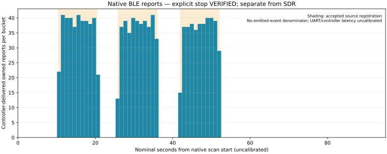

# The native BLE reference completes with 1,176 matching reports

Recorded 2026-10-02. Native version 2 delivered **1,176 exact owned-marker
reports**, deliberately stopped at **90.092830 seconds**, and restored the
entire original flash and reset boot. The capture and supervisor both complete.
This proves the current source is receivable through the supported BLE stack on
this ESP. It does not prove hidden-SDR decoding, channel-37-only reception,
every transmitted event, simultaneous behavior in the earlier SDR trials or an
independent RF instrument.

## Actual stop and retained integrity

[Capture](capture.json) contains 89 consecutive aggregate records and one END,
with contiguous firmware intervals and consistent cumulative count. END records
`completion_mode=application_cancel`, actual `cancel_status=0`, and
`scan_active_after_stop=false`. Host observation is **90.112387 seconds**.
The public cancel API waits for the controller's successful scan-disable
acknowledgement. This is an application stop, not a natural discovery-complete
callback. [Trial 001](../native-ble-source-reference-001/README.md) remains failed;
the observer-only SDK timer omission was not retrospectively repaired.

All **23,554** consumed UART bytes were saved privately and reread with SHA-256
`40baf507b246944ee8ed3d7a5a56fa32d7331007a9da16592e34bf84c7858813`.
Schema, fresh nonce, sequence, complete host-line brackets and cumulative/RSSI
checks pass. UART JSON has no transport CRC, and these checks do not replay
protected BLE PDUs. Counters freeze after the successful stop; later queued
reports cannot change END. Reaching CONFIG/READY also establishes that the target
crypto known-answer and in-place self-tests passed before radio initialization.

## Source schedule and nominal associations

[Source](source.json) completes the same three ten-second episodes with at least
five-second OFF gaps. [Monitor](monitor.json) records all **15** successful
matching HCI command completions: properties `0x0013`, map `0x07`, requested
20-ms interval, LE1M, the whole owned AD, Duration=0 and MaxEvents=0.
The actual initial OFF interval is **10.350 seconds**, and END arrives **37.945
seconds after source process-group closure**. Source bus and owned monitor
container close; powered=true and ActiveInstances=0 match before/after.
No global adapter reset, power or event-mask change occurred.

[Summary](summary.json) and [bucket CSV](native-buckets.csv) retain all 90 buckets.
Guarded nominal ON episodes contain 274, 267 and 267 reports; the four guarded
OFF segments contain zero. The other 368 reports remain in 22 transition buckets.
Whole firmware intervals map from the complete READY receipt bracket, with
one-second transition guards. Clock rate, controller/API and UART latency are
uncalibrated. The plot and phase labels show nominal association, not exact RF
event times or calibrated timing bounds. Counts are delivered reports and may
include duplicates across advertising channels; **the emitted denominator stays
null**, and no detection rate is reported.

## Verified recovery and next diagnostic

[Before-install read](before-install.json) and [restoration](restoration.json)
each match all **4,194,304 bytes** to preserved original SHA-256
`6e8f0793916fa1d701415abc48c6ea91756cf864de8fdbf8459c181b08fc0974`.
The original application, SDK and both GPIO messages appear on reset boot.
Electrical power removal was not measured. [Orchestration](orchestration.json)
records exact executed-file/artifact hashes, natural closure of every owned
process group and no cleanup failures. Images, UART, boot logs and identifiers
remain private.

The [independently reviewed v2 build](../native-ble-reference-independent-review/README.md)
keeps observer-only roles and the immutable SDK. The completed native reference
can enable the [twenty-snapshot gain-state observation](../../research/esp-gain-state-diagnostic.md).
It does not satisfy Trial B's required SDR-positive control, RF repeatability,
calibrated gain/filter characterization or counted-emission gates.
