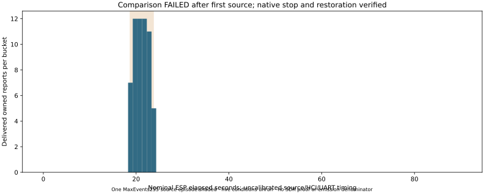

# The comparison stops after its first source; native reception and recovery are retained

Recorded 2026-10-02. The declared six-condition comparison **FAILED** after
the first `MaxEvents=255` episode; the five remaining conditions did not run.
Task returned **201** for the source command's exit **2**, which the supervisor
incorrectly treated as unexpected. The native observer independently completed
its bounded scan and restored the entire original flash and reset boot.
This failed run is retained; it is not a completed comparison.

## Observed reception and controller count

[Native capture](capture.json) records **59 exact owned-marker reports**,
89 consecutive aggregates and one END. It stops at **90.087992 seconds** with
actual application cancel status zero and discovery inactive. [Summary](summary.json)
and [bucket CSV](native-buckets.csv) retain all 90 intervals. Whole firmware
buckets mapped through the complete READY receipt bracket and one-second
guards contain 24 reports in two nominal first-source ON buckets, zero in
15 initial OFF buckets, and zero in 63 final OFF buckets. The other 35 reports
remain in ten transition buckets. This is nominal association; ESP clock rate,
HCI/controller and UART latency are uncalibrated.

[Source records](source-0.json) and the [interrupted monitor](monitor.json)
agree on all five source commands and successful ACKs: handle 1, legacy
nonconnectable/nonscannable properties `0x0010`, primary map 1/channel 37, LE1M,
requested 20-ms interval, five-second duration, MaxEvents=255 and exact whole
owned AD. Actual termination is **`0x3C`, completed-event field 0**.
Own-handle disable and removal both succeed; the source socket and owned
container close without forced removal or interruption. The monitor's failed
`interrupted` status remains visible; it is not converted into a completed
120-second monitor session.

Matching native reports associated with this direct-source episode are useful
reception evidence despite the zero controller field. They do not independently
count RF emissions, prove an Intel firmware cause, complete the planned
MaxEvents comparison or establish hidden-SDR demodulation. Reports may include
duplicates; there is no emitted denominator or detection rate. Trial B's fresh
SDR-positive prerequisite and every RF/count acceptance gate remain unchanged.

All **23,307** consumed native UART bytes were saved privately and reread with
SHA-256 `b6c7b3a273854a77ff3a8ab53df73f9c65ffc9d53437a27e9826927327c274f5`.
Fresh nonce, strict schema, contiguous intervals, sequence and cumulative
counts agree. JSON has no UART transport CRC and does not replay protected
BLE PDUs. Raw UART, flash and identifying boot content remain private.

## Failed supervisor and verified restoration

[Orchestration](orchestration.json) keeps its original failure and
`source_cleanup_verified=false`: the source exit-code check aborted before
its cleanup validator ran. Separate saved source/monitor receipts establish
the observed cleanup; the original failed record is not rewritten. The actual
Task log says its source command exited 2, while the naturally closed Task
group returned 201. The native parent returns zero; all owned groups close,
with powered=true and ActiveInstances=0 unchanged before/after.

[Before-install](before-install.json) and [restoration](restoration.json)
each match every **4,194,304 bytes** to original SHA-256
`6e8f0793916fa1d701415abc48c6ea91756cf864de8fdbf8459c181b08fc0974`.
Reset boot identifies the original application, SDK and both GPIO messages.
This run does not measure an electrical power cycle.

The frozen executed supervisor retains SHA-256
`02f42559a7d3710ebc0e6f996437dbb2cace36193447ba1153335a60c4d805f5`.
Its 22 preflight tests missed the real Task/leaf exit boundary. The
[prospective correction](../../research/native-direct-source-comparison.md)
uses `task --exit-code` only for source children and adds actual Task subprocess
tests. It requires fresh independent review and a separate physical run;
there is no retry inside this failed schedule.

Postprocessing command:
`nix develop .#ci --command task -t .scratch/report_native_direct_failure_001.task.yml report`.
The [summary](summary.json) hashes its executed report script.
