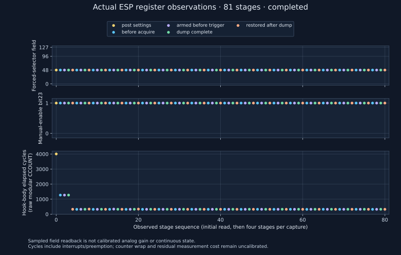

# Bounded register observation: completed run

The corrected supervisor completed a real 20-snapshot diagnostic on
2026-10-02, then restored and independently read every original flash byte.
All **81 sampled stages** observed forced-selector field **48** and manual-enable
**bit23=1**, including before triggering, after dump completion and after cleanup.
This supports sampled field consistency in this run; it does not prove state
between reads, effective analog gain, calibrated sensitivity or RF reception.



[Capture receipt](capture.json) records 20 CRC-valid 40,950-byte IQ payloads:
327,600 pairs / 819,000 payload bytes, exact typed stage order and terminal
totals. The full acquisition took **10.522101644 seconds**, including startup,
queries and settings, within its absolute 30-second ceiling. The separately
saved original wire contains 846,774 bytes with SHA-256
`709aec4d6e1a73b085f9626012f0061831a55933cd701bdbbd05f9e6abc3f57d`.
The supervisor independently parsed original metadata CRCs and binary
boundaries and reread/hashed all saved IQ. Raw UART/IQ stay private.

Measured hook-body elapsed cycles range **323–4,008**, median **325**. These
are raw modular counter observations; interrupts/preemption, counter wrap and
residual measurement instructions remain explicit. At the guarded nominal
240 MHz, division by 240 is only a nominal conversion, not calibrated total
instrumentation cost or RF timing. The [compiled bracket review](../register-observation-cycle-review/README.md)
enumerates the actual measured body and residual instructions.

[Before-install verification](before-install.json) and
[restoration/readback/reset boot](restoration.json) both match the preserved
4 MiB SHA-256
`6e8f0793916fa1d701415abc48c6ea91756cf864de8fdbf8459c181b08fc0974`.
The original application/SDK and both GPIO states were observed after reset;
no electrical power-removal claim follows. The [lifecycle](register-observation.json)
records confirmed owned-group closure and completed capture/restoration.

The unchanged candidate002 manifest is
`7b09e894cc2d2673adb94afb3eb245a06a91b26efd91c566e28f81816cf9ef83`;
its committed firmware build inputs are `bf96681`, SDK `25fe69`, base receiver
`550fade`. The frozen physical caller is `f77cb97`, with corrected caller bytes
approved at `f84d94a`. The [first attempt](../receiver-register-observation-001/README.md)
remains failed because its supervisor rejected startup framing, despite
subsequent independent replay of its saved data and verified restoration.

Settings were applied once: LO 2401 MHz, requested filter 20 MHz/code64,
MANUAL48, ten-bit components, nominal 16 MS/s, `CAP20 16380 6`. Placement stayed
as found. No Bluetooth source, gain repair, retry, retune or decoding was used.
Neither this measurement nor the first run releases Trial B, supplies an
emitted-event denominator or resolves the 2,248 fresh SDR decoding nulls.
All original RF/count acceptance gates remain open.

The [declared protocol](../../research/receiver-register-observation-protocol.md)
documents the Nix/Task commands and separate guard/restoration policy.
Regenerate this measured illustration without hardware:

```sh
nix develop .#ci --command task register:plot -- --receipt docs/evidence/receiver-register-observation-002/capture.json --output docs/evidence/receiver-register-observation-002/stages.svg
```
