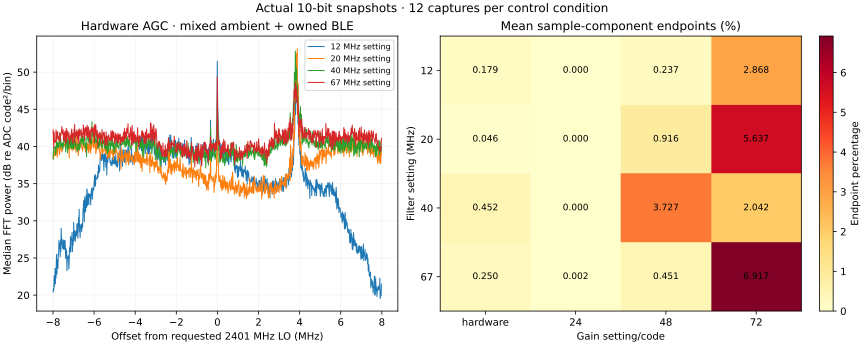

# Physical filter/gain sweep with an owned BLE source

Recorded 2026-10-01. **246 / 246 full 10-bit snapshots passed CRC and sample
counts**: 30 source-OFF baseline captures, 12 captures at each of 16 filter/gain
conditions, and 24 captures after moving the requested LO from 2401 to 2402 MHz.
All use 16 MS/s nominal and 16,380 I/Q pairs through the clean 921600 UART build.

[Manifest](manifest.json), [CSV](captures.csv) and [summary](summary.json)
retain settings, timestamps, private hashes, numerical power and endpoint
fractions. The source requested the same owned BLE marker at 2402 MHz during
one separately bounded advertising episode. Baseline payloads all finished
before registration was requested; every sweep payload finished within the
accepted registration interval. Source-control evidence is recorded separately.
RF timing, transmit power, antenna spacing and actual event count are not
independently measured.

Filter requests are 12/20/40/67 MHz; gain requests are hardware AGC and manual
codes 24/48/72. Each setting returned OK. Those command values are uncalibrated.
The 16 MS/s input does not measure the full wider analog filter passband; wider
settings can admit aliased energy. Ambient RF and the intermittent owned source
both contribute to these spectra, so this is not a calibrated filter response
or a gain-versus-input-power curve.

In this short series, gain code 24 produces essentially no component endpoints,
while gain 72 averages 2.04–6.92% endpoints across the four filter conditions.
At 20 MHz/gain72, the average is 5.64%. Hardware AGC averages 0.046–0.452%.
Exact values and maxima are in the summary. Endpoint concentration is a useful
code-clipping indicator; it does not identify which RF source caused it or
independently measure analog overload. More gain is not automatically useful.

Known-marker decoding and frequency-offset estimates require the separate
decoder manifest; a plausible spectral peak is insufficient. The LO check
does not by itself establish tuning accuracy. No extended-band reception or
absolute sensitivity is accepted from this sweep. Start later trials with a
moderate gain, inspect endpoints and validate actual packet CRCs before choosing
a working setting.

Private original IQ remains ignored under `.scratch/rf-controls-trial-raw/`.
Reproduce the plot with `python3 tools/plot_rf_controls.py docs/evidence/rf-controls-trial .scratch/rf-controls-trial-raw`.
The receiver operator closed the UART after the final capture, then began
restoring the original flash. Source registration/unregistration has its own
operator and cleanup record.
