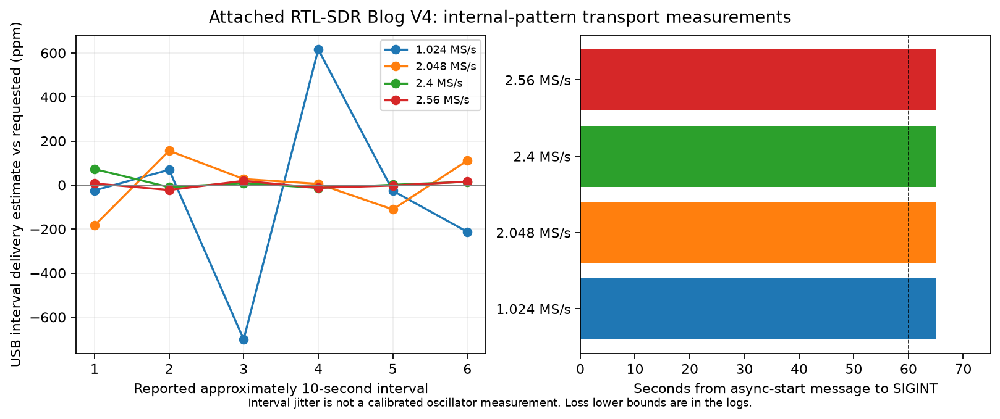

# RTL-SDR Blog V4 continuous transport evaluation

Evidence class: **Board capture**. Captured October 1, 2026 UTC. This is an internal-pattern USB delivery measurement, not RF reception or calibrated frequency accuracy.

The attached receiver identifies as RTLSDRBlog Blog V4 / R828D. Before measurement, `fuser` showed no receiver USB-device owner. One operator ran the four rates sequentially. No EEPROM, transmitter, ESP32 port or bias-tee configuration was used.

## Procedure and provenance

[Capture metadata](capture.json) contains the exact commands, rate estimates, monotonic timing, exit codes and parsed loss results. [Host/tool provenance](provenance.json) records the installed package revision and executable/library SHA-256 values. The installed Arch/Manjaro package declares revision `619ac31`; its corresponding [primary source](https://github.com/osmocom/rtl-sdr/blob/619ac3186ea0ffc092615e1f59f7397e5e6f668c/src/rtl_test.c) explains the internal incrementing-byte checker. Binary hashes identify the local installation; the package declaration alone does not prove a reproducible upstream build.

Reproduction: `python3 tools/measure_rtl_continuity.py --output docs/evidence/rtl-continuity-new`. Each command uses `rtl_test -d 0 -s RATE -p10`, with line-buffered output, 65 seconds after the async-start message, then SIGINT and a bounded cleanup wait. This extends the proposal's plain `rtl_test` recipe with ten-second interval estimates without changing its test-pattern loss checker. Tool output is retained verbatim except the device serial identifier is redacted.

## Limits

The checker uses an eight-bit incrementing pattern. It reports a lower bound on missing **bytes**, despite its final label saying samples per million. Gaps that preserve the modulo-256 pattern can be invisible. The integer-per-million final summary can round to zero even when an individual discontinuity was reported. The per-run byte counts and report counts are therefore shown separately.

Interval rate estimates depend on USB callback timing and host scheduling; they are not a calibrated TCXO/PPM measurement. The start message precedes actual reading slightly, so the five-second margin and recurring rate reports support the requested 60-second trial. There is one trial per rate, no controlled host-load sweep, no normal-IQ sample sequence counter, and no sensitivity or RF-bandwidth result. An antenna is unnecessary for this internal-pattern test and was not physically verified.

The other receiver-comparison tasks remain open pending known-source/antenna verification, ESP timing results, and converter/reference inventory. Manufacturer HF-to-UHF coverage is described in the [V4 design documentation](https://www.rtl-sdr.com/rtl-sdr-blog-v4-dongle-initial-release/); this transport experiment does not independently validate that coverage.

## Measured results

| Requested complex rate | Async-start to SIGINT | Reported lost bytes (lower bound) | Discontinuity reports | Final integer loss/million |
| --- | ---: | ---: | ---: | ---: |
| [1.024 MS/s](rate-1024000.log) | 65.009 s | 0 | 0 | 0 |
| [2.048 MS/s](rate-2048000.log) | 65.091 s | 80 | 1 | 0 |
| [2.4 MS/s](rate-2400000.log) | 65.064 s | 0 | 0 | 0 |
| [2.56 MS/s](rate-2560000.log) | 65.016 s | 0 | 0 | 0 |

All four runs exited with code 0, reported user cancellation, and released their process handles. The 2.048 MS/s result has one reported gap of at least 80 bytes; its zero-per-million summary is integer rounding. The other three trials have no reported gaps. This single four-rate session does not establish that 2.048 MS/s is inherently less reliable than the other rates.

Recreate this measured plot with `python3 tools/plot_rtl_continuity.py docs/evidence/rtl-continuity` (NumPy and Matplotlib required for plots). It is a plot of physical transport measurements, not a design drawing.
