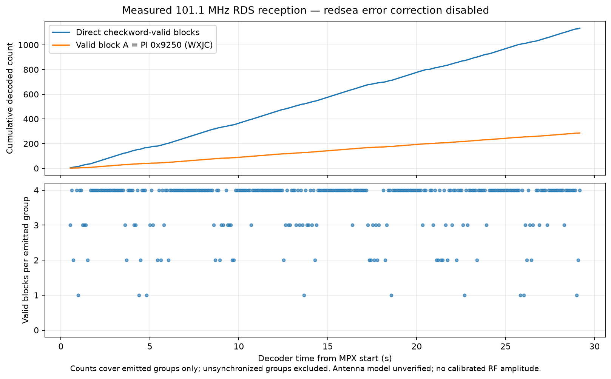

# Fresh 101.1 MHz FM/RDS reception with the user-reported dipole

The attached RTL-SDR Blog V4 received and decoded **WXJC on 101.1 MHz** in a
new bounded trial after the user reported that the connected antenna was a
dipole. This demonstrates a useful FM/RDS receive application with the current
setup. Dipole type is user-attested; its exact model, dimensions, orientation
and physical attachment were not independently inspected.

Root operated the receiver once, receive-only. The publishing agent processed
the closed capture and decoder records offline without opening any device.
No previous antenna type is assumed, and no improvement or decline is
attributed to changing the antenna.

## Actual bounded result

| Measurement | Recorded result |
| --- | --- |
| Requested demodulated channel | 101.1 MHz |
| Requested capture limit / process duration | 30.0 s / 30.16224102000706 s |
| Nominal MPX sample duration | 29.330713450292397 s at requested 171,000 samples/s |
| Emitted decoder groups | 317 |
| Groups with four valid blocks | 233 |
| Valid / missing blocks within emitted groups | 1,137 / 131 |
| Direct valid raw block A | 287 × PI `0x9250` |
| Decoder callsign / RadioText | `WXJC` / `www.lwf.org -` |
| Receiver / decoder exit | 0 / 0; no forced kill |

The [actual receiver log](live-receiver.log) identifies RTL-SDR Blog V4 and the
R828D tuner, sets 19.70 dB gain, reports 1,368,000.013046 Hz ADC sample rate and
171,000 Hz output. The driver's 101.442 MHz hardware tuning is its offset
sampling choice; the requested demodulated station remains 101.1 MHz. Bias tee
was not enabled. Nominal MPX duration comes from the retained byte count and
requested output rate, not a calibrated wall-clock RF measurement.

The station-owned [WXJC website](https://www.wxjcradio.com/) identifies WXJC
Radio / Truth 101.1. That matches the requested frequency, decoder callsign and
repeated direct PI observations. PI-to-callsign interpretation follows the
[pinned RBDS implementation](https://github.com/windytan/redsea/blob/4cc27df9939798e800c4ff7cb484be6d9bf68b4d/src/tables.cc#L321).
This is known-broadcast attribution, not authenticated transmitter identity.
The actual PS values include `www.lwf.`, `  w.lwf.`, ` org -  ` and an unusual
seven-spaces-plus-`Ð` value; the evidence retains these without correcting them.

## What the decoder checks and plot show

The actual command used pinned redsea v1.3.1 with
`--no-fec --show-raw --rbds --bler --time-from-start`. Its
[block synchronization code](https://github.com/windytan/redsea/blob/4cc27df9939798e800c4ff7cb484be6d9bf68b4d/src/block_sync.cc#L246)
accepts a block only when its syndrome matches the expected offset; with FEC
disabled, burst-error correction is skipped. Missing blocks appear as `----`.
This is the decoder's RDS ten-bit checkword validation. The published 16-bit
block data do not contain the original check bits for a separate CRC replay.

The totals were independently recounted from [actual groups](live-decoder.ndjson),
using raw block A for direct PI rather than potentially inherited JSON `pi`.
They cover emitted groups, including partial groups. Unsynchronized or omitted
groups outside the output are not measured. Neither 1,137 / 1,268 nor rolling
BLER is an overall RF success rate or USB continuity measurement.

This chart was generated by [RDS_plot.py](../../../tools/RDS_plot.py) from the
new records, not from the earlier trial. It plots 316 timestamped emitted groups,
ending at 1,135 valid blocks and 286 direct PI blocks. The final partial group
contains two valid blocks including PI but has no timestamp; it remains in the
reported totals and is omitted from the chart rather than assigned an invented
time. The plot labels the antenna model unverified and claims no calibrated RF
amplitude. It is a decoder-result plot, not an RF waveform or site screenshot.

## Evidence, preservation and scope

[Public trial metadata](live-trial.json) preserves the actual source fields,
command arguments, binary hashes and decoder summary. Publication replaced
only executable host paths with command names and annotated the user-reported
dipole. The tool's original default antenna note is retained separately and
does not negate the user's report before capture. Its generic note about no
physical intervention describes the capture operation, not prior user actions.

[receipt.json](receipt.json) records original private receipt hashes, public
file hashes, independent counts, plot exclusions, tool hashes and pinned source
provenance. The decoded groups and [decoder log](live-decoder.log) were copied
byte-for-byte; the receiver log was already serial-redacted. Original private
metadata and logs remain unchanged. Raw MPX audio stays private and is not
published: 10,031,104 bytes, SHA-256
`57abd62b961d95ee8c0e4b471101e6962a3aa1b1b6dbc5768ba12f0e4f255e47`.

The actual redsea binary hash is
`db77a477a4d9747f09f1e4cf8bba98df807b8763d8e752ff4cb74614d64cf461`,
matching source commit `4cc27df9939798e800c4ff7cb484be6d9bf68b4d` and the
previously recorded pinned build. Independent root review can replay this
closed private MPX input without another receiver operation.

The measured recommendation is to use the current setup for **101.1 MHz FM/RDS
reception and broadcast-metadata study**. This trial does not establish general
HF/VHF coverage, dipole bandwidth or calibration, reception on every frequency,
or performance relative to the earlier unidentified antenna. The user reports
no external RF generator, reference receiver, attenuators or frequency converter;
this run supplies no controlled sensitivity, dynamic-range or same-signal ESP
comparison. Those measurements require separate evidence. No OpenSpec task or
requirement is marked complete by this documentation checkpoint.
