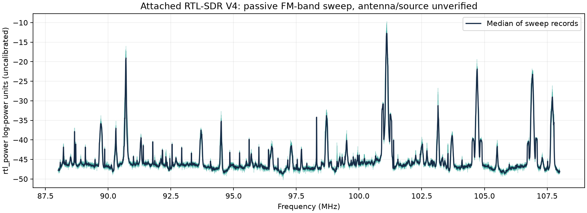
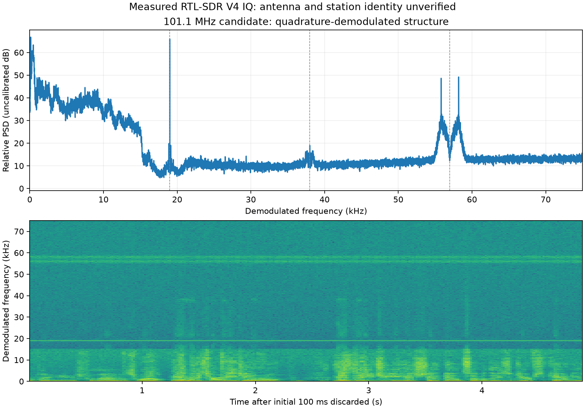

# Passive FM-band discovery and demodulated signal structure

Evidence class: **Board capture**. Captured October 1, 2026 UTC. The antenna attachment/type and station identity were **not verified**. This is measured receive-only evidence, not completed known-source application proof.

## Survey

[Capture metadata](capture.json) records the exact settings and executable hash. [Receiver output](receiver.log) confirms V4/R828D detection, gain 19.7 dB, nine sequential hops, and 2.777777 MS/s within each hop. The configured sweep was 88–108 MHz, at most 10 kHz bins, 20% edge cropping, two-second records, and a twenty-second stop timer. The actual process ran 20.262 seconds, exited with code 0, and did not require forced stopping. No bias tee, EEPROM, transmitter or ESP32 port was used.

[Raw FFT records](fm-sweep.csv) contain 90 hop rows across ten timestamp groups. Power units are uncalibrated despite the tool's CSV documentation saying dBm. This is a sequential scan, not simultaneous continuous 20 MHz IQ. Peaks near 90.7, 101.1, 104.7 and 106.9 MHz are candidate broadcast-channel signals; an unknown antenna path and ambient source do not establish a calibrated RF response or specific station identity.

Reproduce the sweep with `python3 tools/survey_rtl_fm.py --output docs/evidence/rtl-fm-survey-new`; regenerate the spectrum using `python3 tools/plot_rtl_sweep.py docs/evidence/rtl-fm-survey`. The plot uses measured CSV rows, not a design drawing.

An initial attempt used `-c 20` and was rejected before receiver streaming; this tool expects `-c 0.2`. [Failed attempt metadata](../rtl-fm-survey-invalid-crop/capture.json) and [output](../rtl-fm-survey-invalid-crop/receiver.log) preserve that configuration failure separately from the successful corrected trial.

## Candidate FM structure

[IQ capture settings and hash](iq-capture.json) and [receiver output](iq-capture.log) record a 5,120,000-pair normal unsigned eight-bit IQ capture at 1.024 MS/s, center 101 MHz, gain 19.7 dB. The file has 10,240,000 bytes, exactly five seconds by nominal sample count; elapsed process time was 5.902 seconds including setup. A sample file of the expected size does not prove the absence of RF-mode gaps; this mode has no incrementing-pattern discontinuity counter. The raw file remains locally in ignored scratch storage, with its hash recorded; derived spectral evidence is published.

The analysis shifts the 101.1 MHz candidate to baseband, filters with a 255-tap 90 kHz lowpass, decimates by four, computes the quadrature phase difference, and discards the first 100 ms. [Analysis results](fm-analysis.json) report a peak at 19,000 Hz, 56.256 dB above the defined nearby spectral median. This ratio describes the derived PSD, not receiver sensitivity or calibrated RF SNR. No input bytes were at either of the chosen endpoint ranges (0–1 or 254–255), which is a limited clipping indicator, not a dynamic-range measurement.

A 19 kHz pilot is consistent with the pilot-tone FM stereo multiplex described in [ITU-R BS.450-4](https://www.itu.int/rec/R-REC-BS.450/en). That consistency is an inference from measured structure, not station identification. The 38/57 kHz markers are reference frequencies; the plot does not claim decoded stereo or RDS data.

Regenerate with `python3 tools/analyze_rtl_fm.py --iq .scratch/fm101.iq --folder docs/evidence/rtl-fm-survey` (NumPy, SciPy, Matplotlib). The exact receiver command is in the IQ metadata. To reproduce a fresh physical capture, create the ignored scratch directory and run that command while owning the receiver, then retain new metadata instead of overwriting this historical record.

## Outcome and limits

The receiver delivered a useful-looking FM multiplex candidate on this host. Appropriate antenna identity, known-source verification and a selected application decoder/audio result remain missing. Task 1.2 remains unchecked. No HF, aircraft, AIS, ADS-B or telemetry decoding was demonstrated. `fuser` reported no receiver USB-device owner after the last capture; hardware was released.
