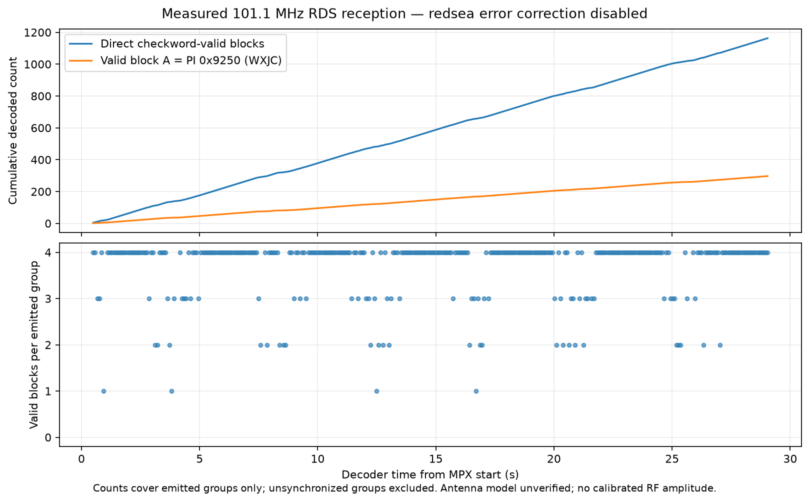

# Real FM/RDS application on the attached RTL-SDR V4

The retained 101.1 MHz candidate is now attributed to **WXJC** by repeatedly
validated RDS program-identification blocks. The receiver also delivered a
complete public RadioText message in a fresh bounded trial. This demonstrates
a useful receive application under the current setup, beyond identifying a
19 kHz pilot. It does not identify the antenna model or establish calibrated
sensitivity, audio quality, every-band coverage, or ESP32 reception.

## Measured results

| Trial | Input duration | Emitted groups | Four valid blocks | Valid blocks in emitted groups | Direct valid block-A PI |
|---|---:|---:|---:|---:|---:|
| Retained unsigned-8 IQ | 5.000 nominal seconds; initial 100 ms discarded after demodulation | 41 | 30 | 149 | 40 × `0x9250` |
| New signed-16 MPX | 29.330713 nominal seconds; 30.155831 s process | 317 | 245 | 1,163 | 297 × `0x9250` |

Both decoder runs exited 0. The live receiver exited 0 after a bounded SIGINT;
no forced kill was needed. Its log detects **RTL-SDR Blog V4 / R828D**, sets
19.70 dB gain, records 1,368,000.013046 Hz requested-as-1,368,000 ADC sampling,
and outputs 171,000 Hz MPX. The driver tunes the hardware to 101.442 MHz for
its offset sampling; the requested demodulated channel remains **101.1 MHz**.
Bias tee was not enabled. The sample-count duration excludes receiver startup
and shutdown and assumes the requested rate; it is not calibrated wall-clock RF
timing or a USB lost-sample measurement.

The actual output includes `callsign: WXJC`, program type `Religious talk`, and
RadioText `The Holy Hills Of Heaven - Rick Webb Family`. The station-owned
[WXJC homepage](https://www.wxjcradio.com/) identifies WXJC / Truth 101.1,
matching the decoded callsign and channel. PI interpretation follows the
[pinned decoder's RBDS callsign implementation](https://github.com/windytan/redsea/blob/4cc27df9939798e800c4ff7cb484be6d9bf68b4d/src/tables.cc#L271).
This is strong broadcast attribution, not authenticated transmitter identity.
The PS values include rotating ` God Is ` / `Control ` fragments and an unusual
seven-spaces-plus-`Ð` value. Preserve those actual values; no corrected station
name is inferred from them.

## What “valid” means here

The pinned **redsea v1.3.1** decoder ran with `--no-fec --show-raw --rbds --bler
--time-from-start`. Its [block synchronization implementation](https://github.com/windytan/redsea/blob/4cc27df9939798e800c4ff7cb484be6d9bf68b4d/src/block_sync.cc#L270)
checks the 26-bit block's ten-bit syndrome against the expected offset. With
error correction disabled, only blocks passing that check are marked received.
Invalid blocks become `----` in `raw_data`. This is RDS checkword validation
inside the primary decoder, rather than a separate external CRC recomputation.

The counts above cover **emitted groups only**, including partially valid
groups; missing or unsynchronized groups outside decoder output are excluded.
The decoder can carry a previous `pi` field into a partial group. Our direct PI
count instead counts valid raw block A. Do not turn 1,163/1,268 into an overall
RF packet-success rate. Rolling decoder BLER also does not measure USB delivery
loss; use the separate [continuity trial](../rtl-continuity/README.md) for that.

The chart plots actual decoded block counts, not an RF waveform. It excludes
records without a decoder time. The antenna's exact model, physical attachment
and orientation remain unverified. The current receive path is functionally
adequate for this station at this time; that result does not establish antenna
suitability elsewhere. Ambient reception was receive-only and involved no
changes to the setup.

## Evidence and reproduction

- [Retained metadata](retained-trial.json) and [actual groups](retained-decoder.ndjson).
- [Fresh capture metadata](live-trial.json), [sanitized receiver log](live-receiver.log), and [actual groups](live-decoder.ndjson).
- [Pinned host/source provenance](provenance.json), [synthetic negative control](negative-control.json).
- [Upstream tests with correct resource directory](upstream-tests-correct-cwd.log): exit 0, 37 passed cases and one upstream expected failure, 1,049 passed assertions and one expected failure. The initial [Meson run](upstream-tests.log) is retained: its four resource-path failures came from the external build directory; rerunning with the upstream expected `build/` working directory fixes them.
- [Receive/decode tool](../../../tools/RDS_trial.py), [count regression](../../../tools/RDS_test.py), [plot tool](../../../tools/RDS_plot.py), and [build instructions](../../research/rtl-application/README.md).

Private inputs stay in ignored `.scratch/` and are not shipped with the site.
The original IQ is 10,240,000 bytes, SHA-256
`2f60d138da86399ed28ed55d2290da9277f98d13c552604a0cf3e16aea16d555`.
The reproducible MPX WAV is 2,508,842 bytes, SHA-256
`fc5ff1496dc246e765f3f7088f0a4fadd0738ef68ca2dd0d64d11caaf6e66b7c`.
Fresh MPX PCM is 10,031,104 bytes, SHA-256
`5f189dde13c3551080d0eb3af4ea6801a6f9d8187b379a92d31b848b126a51d0`.

This application proof is distinct from an ESP/V4 same-signal comparison.
A suitable conversion/filter path into the ESP32 band and matched physical
stimulus remain separate gates; this trial does not close them.
