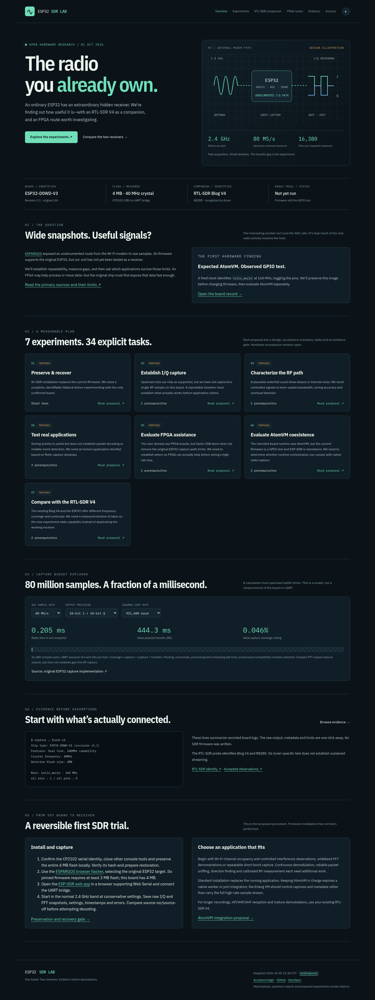

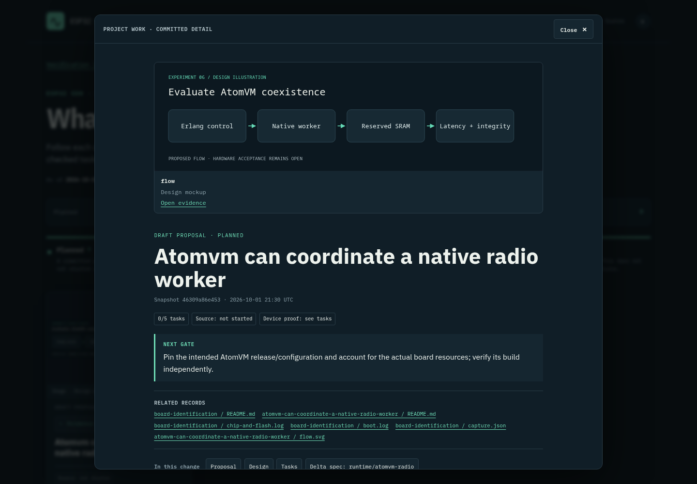
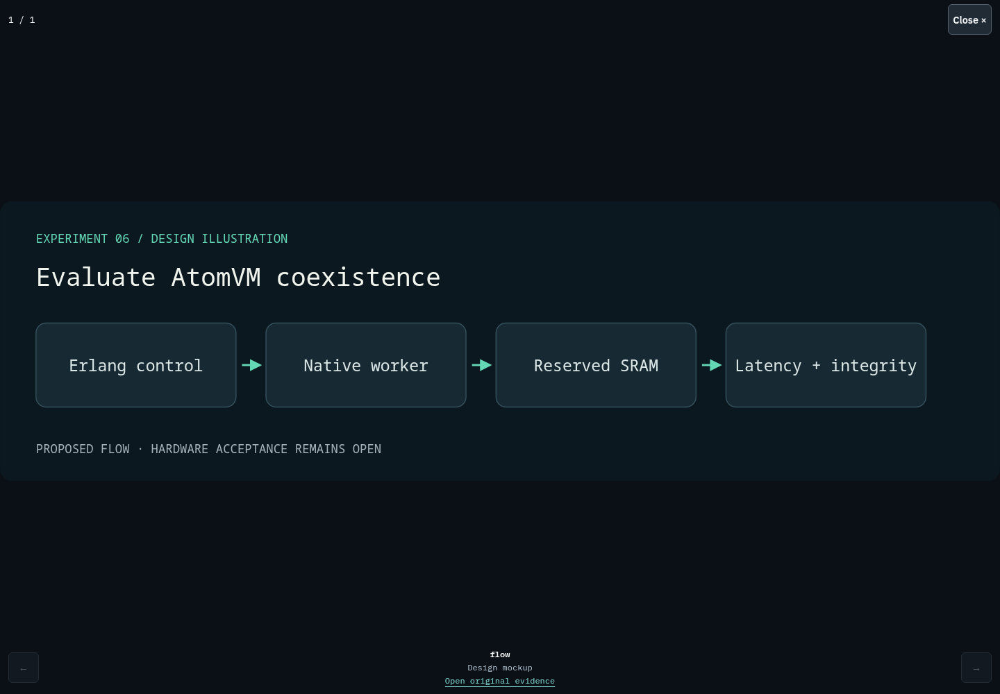

# Research site browser verification

Evidence class: **Host capture**, not RF reception or FPGA measurement.

Captured October 1, 2026 from the built site at source revision `46309a86e453` using Chromium and Playwright. [Metadata](capture.json) records the full revision, time and checks.

Reproduce with `python3 tests/site_browser.py --url http://localhost:4321` after a successful local build and static preview. The check covers desktop/mobile navigation, overflow, calculator values, theme switching, seven proposal cards, deep links, image loading, dialog focus restoration and the boot-log evidence link. No page errors or local HTTP failures occurred.

The gallery displays an explicitly labeled design mockup. These images show the tracking website, not completed hardware experiments. All 34 hardware tasks remain open.
