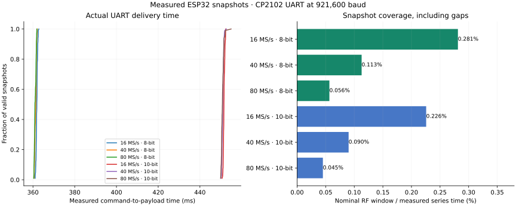

# Physical snapshot baseline, 2026-10-01

**600 / 600 captures passed** payload CRC and requested sample counts: 100
full-size snapshots at each advertised rate, in each of 8-bit and 10-bit I/Q.
This establishes reliable transport for this series, not calibrated sample
clocks, known-signal reception, or continuous recording.

Receiver: identified ESP32-D0WD-V3 rev 3.1, existing unidentified board antenna,
clean `550fade-uart921600` firmware, CP2102 at 921,600 baud. RF settings:
2412 MHz requested center, 20 MHz requested filter, hardware AGC, 16,380 pairs.
[Installation](../sdr-installation-uart921600/README.md) and
[build receipts](../firmware-uart921600/README.md) identify source and SDK.

| Nominal rate | Format | Valid / attempted | Median command-to-payload | Nominal RF coverage |
|---|---|---|---|---|
| 16 MS/s | 8-bit I/Q | 100 / 100 | 361.835 ms | 0.2812% |
| 40 MS/s | 8-bit I/Q | 100 / 100 | 361.364 ms | 0.1128% |
| 80 MS/s | 8-bit I/Q | 100 / 100 | 360.945 ms | 0.0565% |
| 16 MS/s | 10-bit I/Q | 100 / 100 | 451.477 ms | 0.2257% |
| 40 MS/s | 10-bit I/Q | 100 / 100 | 450.939 ms | 0.0901% |
| 80 MS/s | 10-bit I/Q | 100 / 100 | 450.767 ms | 0.0451% |

[CSV](snapshots.csv) retains every attempt, CRC, sample count, host timestamps,
payload transfer time, firmware-reported capture duration, private payload
SHA-256, endpoint fraction and anonymous numerical statistics. [Results](results.json)
retain protocol replies, settings, series durations and counts.
[Summary](summary.json) contains the plotted aggregates.

Private binary payloads remain ignored under `.scratch/snapshot-baseline-raw/`.
The root hardware operator opened the stable CP2102 at 921,600, waited 2.5 s,
drained startup text, then called `queries` and `run_snapshots` in
`tools/esp_sdr_capture.py`; RELEASE and close ran in `finally`. The production
handshake subsequently gained bounded startup retries and a nonce fence.
Regenerate aggregates with
`python3 tools/plot_esp_snapshots.py docs/evidence/snapshot-baseline`.

Nominal windows are 1023.75, 409.5 and 204.75 microseconds. Firmware reports
median acquisition durations of 1025, 411 and 206 microseconds, respectively;
these are software-reported timings, not an independent ADC clock measurement.
Coverage divides successful nominal windows by measured series wall time,
including host analysis gaps. It is not a measured probability of receiving
events. UART delivery dominates; increasing ADC rate shortens the listening
window without substantially shortening transfer time.
