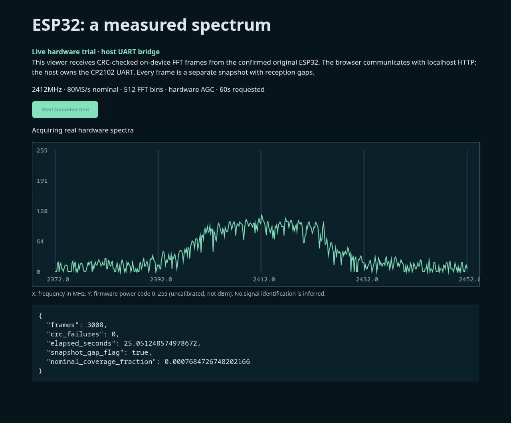

# Verified 60-second hardware spectrum session

Physical acquisition and browser-display evidence, 2026-10-01.
**7205 consecutive CRC-checked frames completed in 60.0052 s**, with matching
firmware end totals and no reported interruption. The selected profile is
80 MS/s nominal, 512 FFT bins, requested center 2412 MHz, requested filter
20 MHz and hardware AGC, using clean `550fade-uart921600` through CP2102.

[Completed browser still](completed-browser.png),
[browser observation](browser-observation.json), [results](results.json)
and [per-frame CSV](spectra.csv) retain settings, sequence, synthesized sample
index, CRC, snapshot-gap flag and host receive time. Private frames remain
ignored under `.scratch/spectrum-baseline-512-raw/spectrum-frames.bin`; their
SHA-256 is `e481b398564399f1d891601067ee1142bc38214ab2a8523a9814958d6a496bcc`.
The handle was released and the localhost server stopped after completion.

Command: `python3 tools/esp_sdr_spectrum_bridge.py --baud 921600 --firmware-revision 550fade-uart921600 --output docs/evidence/spectrum-baseline --private .scratch/spectrum-baseline-512-raw --seconds 60 --rate 80000000 --bins 512`.
Headless Chromium opened the local viewer, clicked Start, saved the live still
at about 25 s, waited for completion and saved the final still and state.

The browser uses localhost HTTP and the host owns UART. This is not native
Web Serial. Firmware performs FFTs on separate snapshots; all frames explicitly
flag gaps. 3,688,960 processed samples equal 46.112 ms of nominal RF time, or
about **0.07685%** of this session's measured wall time. Smooth display updates
do not mean continuous RF capture. Sample index is firmware-synthesized, not an
independent capture-clock measurement. Power codes are uncalibrated, not dBm;
no source identity, RF sensitivity or usable extended band is established.

[The first 1024-bin trial](../spectrum-baseline-1024-failed/README.md) failed
CRC after 40.88 s. The successful smaller profile does not erase that failure
or establish general long-term reliability. Every completed frame in this
trial passed both header/payload CRC, sequence, gap and sample-total checks;
the end report matched received totals and requested duration.
