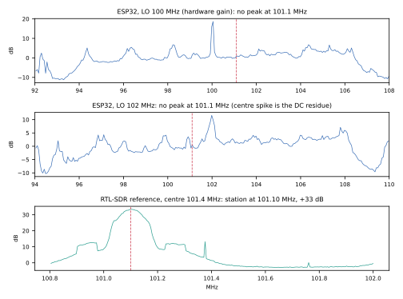

# Controlled spectrum session 002: VHF tuning rejected, usable settings decided

Recorded 2026-10-06 under the [pre-declared protocol](../../research/spectrum-controlled-002-protocol.md).
The original image was preserved before the session, and restored and verified
by full readback afterwards.

## C. Extended tuning against a known signal (task 2.2): rejected

The RTL-SDR reference shows the FM station at **101.10 MHz, 33 dB** above its
floor. Tuned to LO 100 and 102 MHz, the ESP32 shows no peak at the expected
+1.1 or −0.9 MHz. Its strongest features are unrelated tones and the DC
residue. At manual gain 48 it fills with spurs (+22.8 dB at −6.36 MHz) that
don't track any station.

The firmware's 100–6000 MHz range is synthesizer reach. This board's 2.4 GHz
front end and antenna don't receive VHF broadcast, so the extended tuning
point is **rejected**.

## B. Gain 72 (task 2.1): sweep complete

At BW 20 and gain 72: mean AC power 3,579, with 2.0% of components at the ADC
endpoints on average and up to 23.5% in one window. This completes the nine
conditions with [session 001](../spectrum-controlled-001/README.md).

## A. Channel location from decoded packets (task 1.2): not confirmed

Across a declared translation grid, the ch37 capture decoded **4 owned
packets**, all in pair 1, and none in OFF windows. Their absolute carrier is
**2403.73 MHz**: +1.73 MHz from the 2402 MHz channel centre, spread 1.66–1.80
MHz. That matches the [hit-rate runs](../ble-receiver-hitrate-002/README.md).

The capture then faulted after 457 windows on a short UART payload, retained
privately. That left pairs 2 and 3 with almost no ON windows. Channels 38 and
39 did not run.

## Usable settings for later experiments (task 2.3)

| Setting | Decision | Basis |
| --- | --- | --- |
| Band | 2.4 GHz only. VHF (about 100 MHz) is not usable. | Part C |
| Channel / LO | BLE ch37 with LO = channel − 1 MHz | Owned packets decode at ch37 |
| Tuning offset | The carrier lands **+1.7 to +2.4 MHz** above nominal and varies between retunes. Decode with a shift grid, or measure it per tune. | Hit-rate runs, sessions 001–002 |
| Gain | Hardware AGC (endpoint hits ≤0.4% mean). Manual gain ≥48 clips (up to 14–24% of components); gain 16 is too low. | Sessions 001–002 |
| Filter | BW 12 or 20 at 16 MS/s; wider filters can't be distinguished at this rate | Session 001 |
| Capture length | Keep each capture under about 400 windows on a loaded host; longer runs hit short UART reads | Faults in hit-rate run 001 and sessions 001–002 |

Levels are uncalibrated ADC codes, and there is no calibrated reference.
Channels 38 and 39 are not confirmed.

Summary: [results.json](results.json). Raw IQ and logs stay under ignored `.scratch/`.
